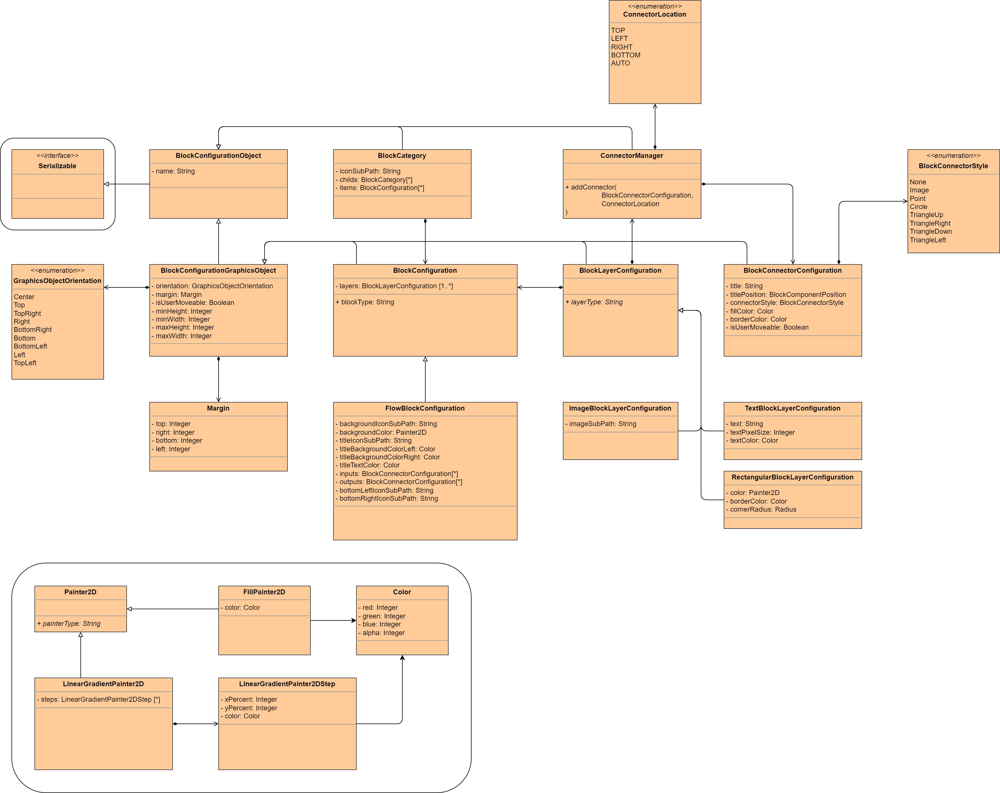

Block Editor
============

Text

=====================
Add Blocks To Network
=====================

1. Send Category to UI: CMD = ..tbd..
2. Category will be displayed in the Navigation tree
3. User can use items from the category and place them in the current block editor
4. Any changes will be send to the owner (service) as a notification
5. Every notification must be confirmed or declined by the owner (service)

=============
Configuration
=============

A configuration consists of an Array containing ``Block Category`` objects.
Every provided ``Block Category`` object will be added to the Block Picker Navigation as a root item.

.. note::
   If providing a ``Block Category`` with an already existing name, the affected categories will be merged.

.. warning::
   If providing items with the same name, any duplicates will be ignored.
