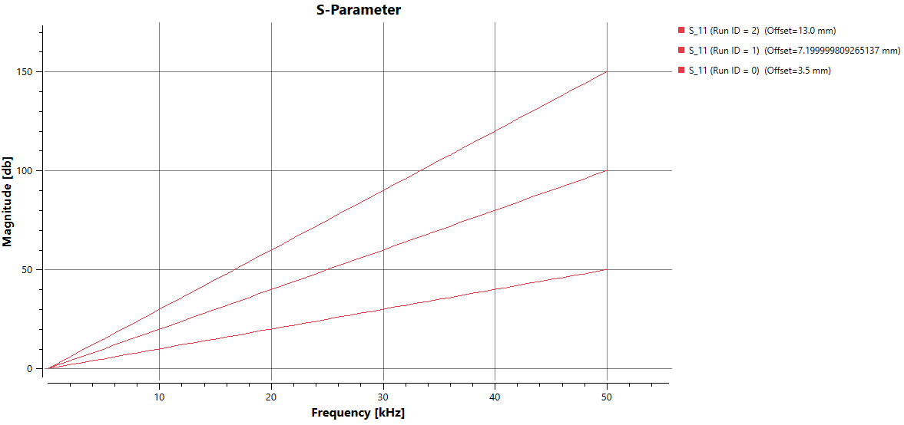

Creating 1D Plots
=================

The `PlotBuilder` class in `ResultDataAccess` provides an interface for constructing 1D plots by assembling datasets and associated curve configurations. Data values are stored directly in the result collection when executing the ``addCurve`` method, while metadata entities are instantiated during the final plot build phase. Once all intended curves are added, invoking the `buildPlot` method will create all necessary metadata and curve entities, and the plot entit itself. Optionally, a new model state may be created.

1. Initialize the Plot Builder
------------------------------

.. code-block:: cpp

   ResultCollectionExtender extender(Application::instance());
   PlotBuilder plotBuilder(extender);

2. Create a Dataset Description
-------------------------------

Each `DatasetDescription` contains a single quantity and one or more parameters.

2.1 Add a Parameter
^^^^^^^^^^^^^^^^^^^

For each parameter, a `MetadataParameter` instance is constructed.

.. code-block:: cpp

   DatasetDescription dataset;
   MetadataParameter parameter;
   for (double& value : xValues)
   {
       parameter.values.push_back(ot::Variable(value));
   }
   parameter.unit = xUnit;
   parameter.parameterName = xLabel;
   parameter.typeName = ot::TypeNames::getDoubleTypeName();

   bool isConst = false; // Set to true if parameter is constant for the entire dataset
   std::shared_ptr<ParameterDescription> parameterDescr(new ParameterDescription(parameter, isConst));
   dataset.addParameterDescription(parameterDescr);

A constant parameter example: the edge length of a cube in simulations that vary only the frequency. All parameter can be shared across multiple dataset descriptions since it is stored as shared reference.

2.2 Add a Quantity
^^^^^^^^^^^^^^^^^^

A `QuantityDescription` defines the dataset's quantity values. In this case, we define a real-valued scalar quantity using `QuantityDescriptionCurve`.

.. code-block:: cpp

   std::unique_ptr<QuantityDescriptionCurve> quantity(new QuantityDescriptionCurve());
   for (const double& value : yValues)
   {
       quantity->addDatapoint(ot::Variable(value));
   }
   quantity->setName(yLabel);
   const std::string secondLevelLabel = "";
   quantity->addValueDescription(secondLevelLabel, ot::TypeNames::getDoubleTypeName(), yUnit);
   dataset.setQuantityDescription(quantity.release());

Quantity naming supports two levels. The top-level name (e.g., `"Voltage"`) is required. Additional descriptors (e.g., `"DC"`, `"AC"`) allow grouping under the same base name. In this example the quantity does not hold a tuple, so that only a single description is added. Ownership of the quantity data is transferred to the dataset.

1. Create a Curve
-----------------

Curve configuration is encapsulated in `Plot1DCurveCfg`. A minimal configuration is shown below:

.. code-block:: cpp

   ot::Plot1DCurveCfg curveCfg;
   curveCfg.setTitle(curveName);
   curveCfg.setXAxisTitle(xLabel);
   curveCfg.setXAxisUnit(xUnit);
   curveCfg.setYAxisTitle(yLabel);
   curveCfg.setYAxisUnit(yUnit);

   const std::string seriesName = curveName;
   plotBuilder.addCurve(std::move(dataset), curveCfg, seriesName);

The final curve entity will be stored under the path:

.. code-block:: text

   Solver/<Solver_Name>/Results/1D/<plotName>/<curveName>

Only the final component (`curveName`) is required by the builder. The series metadata entity, stored under `Dataset/<seriesName>`, links data points to the collection. Again, the builder only requires the last component.

Multiple datasets can be grouped under a single curve entity. For instance, storing S11, S22, and S33 parameters would require three datasets (each with a single quantity) but could be added either as separate curves or grouped under a single curve entity.

3.1 Set Curve Color
^^^^^^^^^^^^^^^^^^^
A conviniend method to choose a colour is by iterating through the colour schema depending rainbow.

.. code-block:: cpp

   ot::PainterRainbowIterator rainbowPainterIt;
   auto stylePainter = rainbowPainterIt.getNextPainter();
   curveCfg.setLinePen(stylePainter.release());

4. Create a Plot
----------------

After adding at least one curve, the final plot can be created.

.. code-block:: cpp

   ot::Plot1DCfg plotCfg;
   plotCfg.setEntityName(fullPlotName);
   const bool storeModelState = false;
   plotBuilder.buildPlot(plotCfg, storeModelState);

The default configuration generates a Cartesian plot with real number values. The full entity path must be provided, e.g.:

.. code-block:: text

   Solver/<Solver_Name>/Results/1D/<plotName>

5. Example
-----------

.. code-block:: cpp

    const std::string collName = Application::instance()->getCollectionName();

    ResultCollectionExtender extender(collName, *Application::instance()->modelComponent(), &Application::instance()->getClassFactory(), OT_INFO_SERVICE_TYPE_ImportParameterizedDataService);
    PlotBuilder builder(extender);
    MetadataParameter parameter;
    parameter.parameterName = "Frequency";
    parameter.typeName = ot::TypeNames::getFloatTypeName();
    parameter.unit = "kHz";

    ot::Plot1DCurveCfg curveCfg;
    curveCfg.setXAxisTitle("Frequency");
    curveCfg.setXAxisUnit("kHz");
    curveCfg.setYAxisTitle("Magnitude");
    curveCfg.setYAxisUnit("db");

    const std::string plotName = "Test/S-Parameter";

    std::vector<float> offsets{ 3.5f,7.2f,13.f };
    std::shared_ptr<ParameterDescription> parameterDesc = nullptr;
    std::list<DatasetDescription> descriptions;
    for (int runID = 0; runID < 3; runID++)
    {
        DatasetDescription description;
        
        std::unique_ptr<QuantityDescriptionCurve> quantDesc(new QuantityDescriptionCurve());
        quantDesc->setName("S_11 (Magnitude)");
        quantDesc->addValueDescription("", ot::TypeNames::getFloatTypeName(), "dB");
        
        for (float i = 0.; i <= 50.; i++)
        {
            float value = i * (runID+1);
            quantDesc->addDatapoint(ot::Variable(value));
            parameter.values.push_back(ot::Variable(i));
        }
        if (parameterDesc == nullptr)
        {
            parameterDesc.reset(new ParameterDescription(parameter, false));
        }

        MetadataParameter additionalParameter;
        additionalParameter.parameterName = "Offset";
        additionalParameter.values.push_back(offsets[runID]);
        additionalParameter.typeName = ot::TypeNames::getFloatTypeName();
        additionalParameter.unit = "mm";
        std::shared_ptr<ParameterDescription> additionalParameterDescription(new ParameterDescription(additionalParameter, true));
        
        description.setQuantityDescription(quantDesc.release());
        description.addParameterDescription(parameterDesc);
        description.addParameterDescription(additionalParameterDescription);
        descriptions.push_back(std::move(description));
    }

    int counter = 0;
    ot::PainterRainbowIterator rainbowPainterIt;
    for (auto& description : descriptions)
    {
        curveCfg.setTitle("S_11 (Run ID = " + std::to_string(counter) + ")");
        auto stylePainter = rainbowPainterIt.getNextPainter();
        curveCfg.setLinePen(stylePainter.release());
        counter++;
        builder.addCurve(std::move(description), curveCfg, "Run_ID_" + std::to_string(counter));
    }
	ot::Plot1DCfg plotCfg;
	plotCfg.setEntityName(plotName);
	builder.buildPlot(plotCfg);

Executing this will result in:

