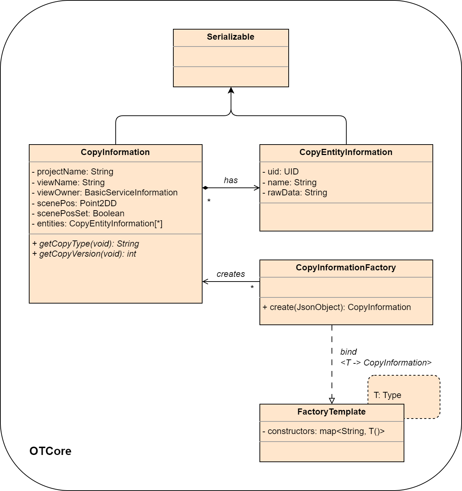

Entity Copy Request
###################

Proposal:

An entity copy request is triggered by a specific view that supports copy/paste.
The copy information contains the entities that are selected in this view aswell as the correct copy information type.
The request is forwarded to the frontend which will add the project information and request the raw data of the selected entities from the model.
The raw data is added to the configuration and serialized to the clipboard.

The paste is also requested by the view. The view notifies the frontend which will forward the paste request to the model.
The request contains the copy information which holds the raw data of the entitites.

Class Diagram
*************

Sequence Diagram
****************

