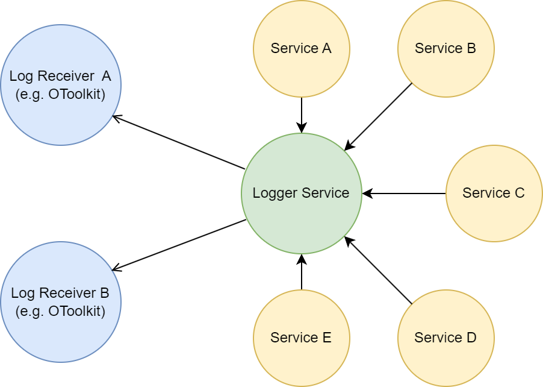

Logging
#######

OpenTwin provides a :doc:`Logger Service</services/logger_service>` that can receive log messages from multiple services.
The Logger Service stores the received log messages and forwards them to any registered Log Receiver.

Setup Logger
============

If the central logging system (using the Logging service) is required then the ``OTCommunication/ServiceLogNotifier`` should be used.
The initialize method ot the ServiceLogNotifier will call the initialize method of the LogDispatcher and register the ServiceLogNotifier object at the LogDispatcher.

.. code-block:: c++

    #include "OTCommunication/ServiceLogNotifier.h"

    char * init(const char * _arg1, const char * _arg2, const char * _arg3, const char * _arg4) {
    #ifdef _DEBUG
        // In a Debug configuration the log messages should also be written to std::cout (true).
        ot::ServiceLogNotifier::initialize("MyServiceName", "LoggingServiceURL", true);
    #else 
        // In a Release configuration the log messages should not be written to std::cout (false).
        ot::ServiceLogNotifier::initialize("MyServiceName", "LoggingServiceURL", false);
    #endif
        ...
    }

.. note::
   If the service is using the ``OTServiceFoundation/Foundation`` the ``ot::foundation::init`` method will call ``ot::ServiceLogNotifier::initialize`` by providing the service name that is set in the provided ApplicationBase object.

When creating the ``ServiceLogNotifier`` instance, it sets the logging options from the following environment variables.

.. list-table::
    :header-rows: 1

    * - Name
      - Description
    
    * - OPEN_TWIN_LOGGING_URL
      - The URL where the :doc:`Logger Service</services/logger_service>` is running at.

        If the URL is either empty, or starts with ``//`` then the log messages won't be send to the :doc:`Logger Service</services/logger_service>`

    * - OPEN_TWIN_LOGGING_MODE
      - Sets the active log flags that determine which log messages will be generated.
        
        A union of multiple flags can be created by splitting them with a '|' character (without any blank space)

        * INFORMATION_LOG: *General information log*
        
        * DETAILED_LOG: *Detailed information log*
        
        * WARNING_LOG: *Warning log*

        * ERROR_LOG: *Error log*

        * INBOUND_MESSAGE_LOG *Execute enpoint message received log*

        * QUEUED_INBOUND_MESSAGE_LOG *Queue endpoint message received log*

        * ONEWAY_TLS_INBOUND_MESSAGE_LOG *One way tls endpoint message received log*

        * OUTGOING_MESSAGE_LOG *Outgoing message log*

        * TEST_LOG *Test (e.g. Runtime Test) message log*

        * ALL_GENERAL_LOG_FLAGS *All general log flags will be set (Default, Detailed, Warning, Error)*

        * ALL_INCOMING_MESSAGE_LOG_FLAGS *All flags for incoming messages will be set*

        * ALL_OUTGOING_MESSAGE_LOG_FLAGS *All flags for outgoing message will be set*

        * ALL_MESSAGE_LOG_FLAGS *All flags for incoming and outgoing messages will be set*

        * ALL_LOG_FLAGS *All log flags will be set*

.. note::
   The environment variables are optional. Also the variables will be set when running OpenTwin by using the batch files provided with OpenTwin.

Generate Log Messages
=====================

To generate log messages at any point in your code use the :ref:`macros<logMacros>` defined in the ``OTCore/Logger.h`` header file.
Log messages will be send to the :doc:`Logger Service</services/logger_service>` if the provided log flags are allowed. 

.. code-block:: c++

    #include "OTCore/Logger.h"

    namespace test {
        void foo(void) {
            OT_LOG_I("Hello World!");
        }
    }

The example above will generate a log message with:

* Service name: The service that was set in the initialize function.
* Function name: test::foo.
* Type: Information.
* Text: Hello World!.
* LocalSystemTime: The time where the Log message object was generated (UTC).
* GlobalSystemTime: The time when the Log message was received by the LoggerService (UTC).

.. _logMacros:

Log Macros
----------

* ``OT_LOG_I`` Information log: General information.
* ``OT_LOG_D`` Detailed log: Detailed information.
* ``OT_LOG_W`` Warning log.
* ``OT_LOG_E`` Error log.
* ``OT_LOG_T`` Test log.

If any other log type(s) should be set for the log message, use the ``OT_LOG`` macro and provide the desired flags.

The Information, Detailed, Warning, Error and Test log macros have the following special types:

* ``A`` Assert before log. The log message will be displayed in the assert messsage. Message must be a C-String (const char*) (e.g. LOG_EA("Test") -> Log Error & Assert).
* ``AS`` Assert simple before log. The Assert will have no message set. Especially useful when wanting to assert but to log a std::string at the same time (e.g. LOG_EAS("Test: " + myString) -> Log Error & Assert simple).

Use file logging
****************

If the log messages should be written to a file the environment variable ``OPEN_TWIN_FILE_LOGGING`` should be set to ``true``.
If the file logging is enabled all log messages will be written to a file in the working directory of the application.
The file name is ``<Service Name>.otlog``.

.. note::
    A valid service name must be provided to the ``ot::LogDispatcher::initialize`` or ``ot::ServiceLogNotifier::initialize`` method.
    
View the Log
************

There are two approaches to view the log messages.

The first one is to register a receiver at the logger service,
this receiver will get all the currently buffered log messages when registrating at the :doc:`Logger Service</services/logger_service>`. Afther the registration the receiver will receive a copy of every new log message.

The second approach is to request the currently buffered log messages.