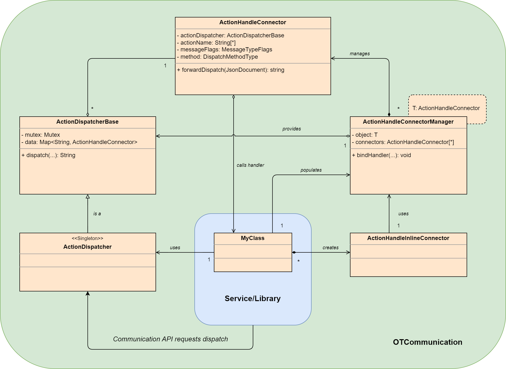
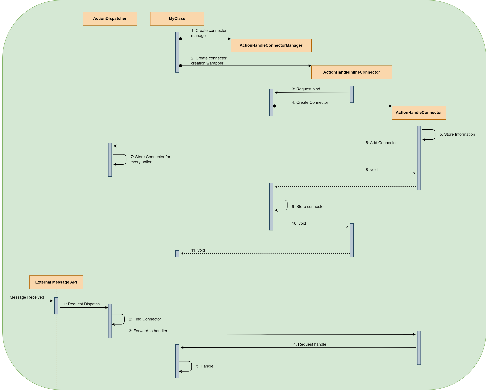

Messaging
=========

The backend uses http with mTLS for the communication.
External services can request a relay to be started on the backend via a one way tls request.
The relay will communicatate with the backend via the same communication api.
Also a websocket server service will be launched to communication with the external service.
The relay information will be transmitted as a reponse to a successful create session request to the LSS.

Here is a list with the endpoints a backend service has:

#. queue
#. execute
#. execute-one-way-tls

Action Handling
***************

The action handling is performed by the OTCommunication api.
For more information about the api read the `dispatch documentation <../_static/code/d6/dc1/classot_1_1_action_dispatcher.html>`_ and `connector documentation <../_static/code/db/d97/classot_1_1_action_handle_connector.html>`_ 

The following sequence diagram displays the default setup sequence when following the default :ref:`action handler syntax <document_the_code>`.

.. _document_the_code::

Default Action Handling Example
===============================

The following example demonstrates how register a class to receive actions at designated handler methods.

.. code-block:: c++

    // MyClass.h
    
    #include "OTCommunication/ActionHandler.h"

    class MyClass {
        // Use this to create the default connector manager.
        // A setter method to connect handler from source is created aswell.
        OT_DECL_ACTION_HANDLER(MyClass)
        ...

        // Create public handle methods
    public: OT_HANDLER(handleMyActionPublic1, MyClass, "MyAction1", ot::MessageType::ALL_MESSAGE_TYPES)
    public: OT_HANDLER(handleMyActionPublic2, MyClass, "MyAction2", ot::MessageType::ALL_MESSAGE_TYPES)
        ...

    private:
        // Create private handle methods
        OT_HANDLER(handleMyActionPrivate1, MyClass, "MyAction3", ot::MessageType::ALL_MESSAGE_TYPES)
        OT_HANDLER(handleMyActionPrivate2, MyClass, "MyAction4", ot::MessageType::ALL_MESSAGE_TYPES)
        ...

        // Create private handle method with multiple actions registed for it.
        OT_HANDLER(handleMultipleActions, MyClass, 
            OT_ACTIONLIST("MyAction5", "MyAction6")
            ot::MessageType::ALL_MESSAGE_TYPES)
    };

Manual Declaration Example
==========================

Use the following approach if the not all IDE features are working when using OT_HANDLER

.. code-block:: c++

    // MyClass.h
    
    #include "OTCommunication/ActionHandler.h"

    class MyClass {
        OT_DECL_ACTION_HANDLER(MyClass)
    
        ...

    private:
        // Declare handler method "std::string <name>(ot::JsonDocument& <arg>)".
        // May be declared at any required scope.
        // The action dispatcher gets a reference to this method,
        // therefore the visibility does not matter.
        std::string handleMyActionPrivate(ot::JsonDocument& _document);
        
        // Connect the action to the handle.
        // Add the OT_CONNECT_HANDLE to receive the "MyAction" action at handleMyActionPrivate method.
        OT_CONNECT_HANDLE(handleMyActionPrivate, MyClass, "MyAction", ot::MessageType::ALL_MESSAGE_TYPES)

        // A compact example:

        //! @brief My description
        //! My detailed description.
        std::string handleMyActionPrivate2(ot::JsonDocument& _document);
        OT_CONNECT_HANDLE(handleMyActionPrivate2, MyClass, "MyAction2", ot::MessageType::ALL_MESSAGE_TYPES)
    };

Custom Action Handling Example
==============================

A custom ``ActionDispatcher`` may be created in case the application requires multiple levels of action handling
(e.g. Applications running in multiple threads).

.. code-block:: c++

    // MyDispatcher.h

    #include "OTCommunication/ActionDispatcherBase.h"

    class MyDispatcher : public ot::ActionDispatcherBase {
	public:
		static MyDispatcher& instance(void) {
            static MyDispatcher g_instance;
            return g_instance;
        }

	private:
		ActionDispatcher() = default;
		virtual ~ActionDispatcher() = default;
	};
    
    // MyClass.h
    
    #include "OTCommunication/ActionHandler.h"

    class MyClass {
        // Specify the custom action dispatcher to register at
        OT_DECL_ACTION_HANDLER_CUSTOM(MyClass, MyDispatcher::instance())
    
        ...

        // Specify the custom action dispatcher to register at.
        std::string handleMyActionPrivate(ot::JsonDocument& _document);
        
        // Specify the custom action dispatcher to register at.
        OT_CONNECT_HANDLE_CUSTOM(handleMyActionPrivate, MyClass, "MyAction", ot::MessageType::ALL_MESSAGE_TYPES)

        ...
    };
