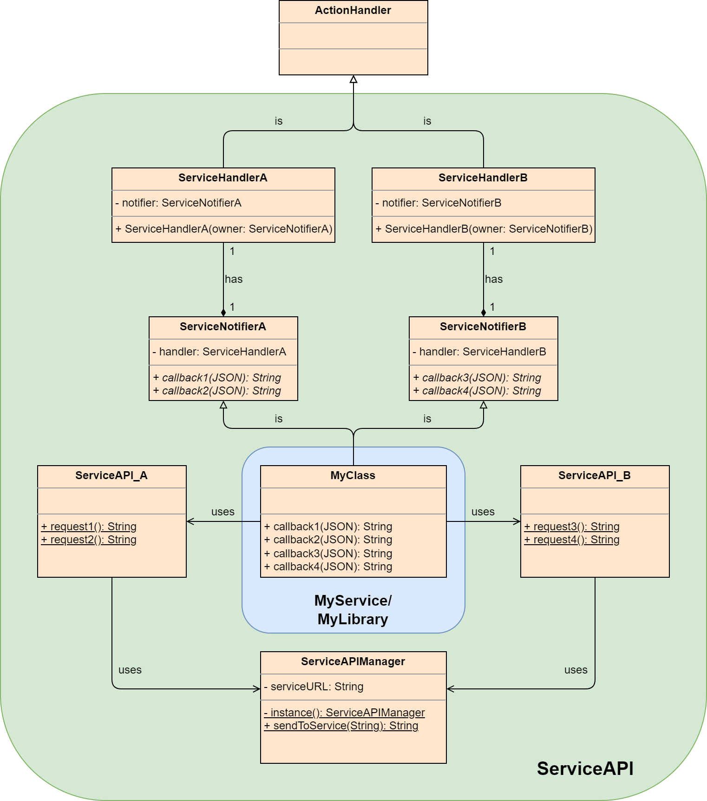

Service API Structure
#####################

Here the general concept of a Service API is described.
A Service API should function as a wrapper for requests that can be serialized and send to the service, aswell as a wrapper for receiving and deserializing requests.
The methods provided by the API should require/provide objects and variables that will be serialized/deserialized in/from the expected syntax of the service.

General Structure
*****************

    **Figure 1:** ServiceAPI Structure

The Service API consist of four main "sections".

#. API Manager: Holds the service URL and handles message sending.
#. Service API: Static methods to serialize and send requests to the service (via API Manager).
#. Service Handler: Action handler for actions send by the service. The messages will be deserialized and forwarded.
#. Service Notifier: Base class with pure virtual methods representing messages from the service. The methods will be called from the ServiceHandler. The class that should receive the desired messages should inherit from it.

The ``MyClass`` shown in Figure 1 represents any class in another library/service that uses the ServiceAPI.
Since ``MyClass`` inhertis from ServiceNotifier it will receive the deserialized messages that were received from the service via the ServiceHandler.
