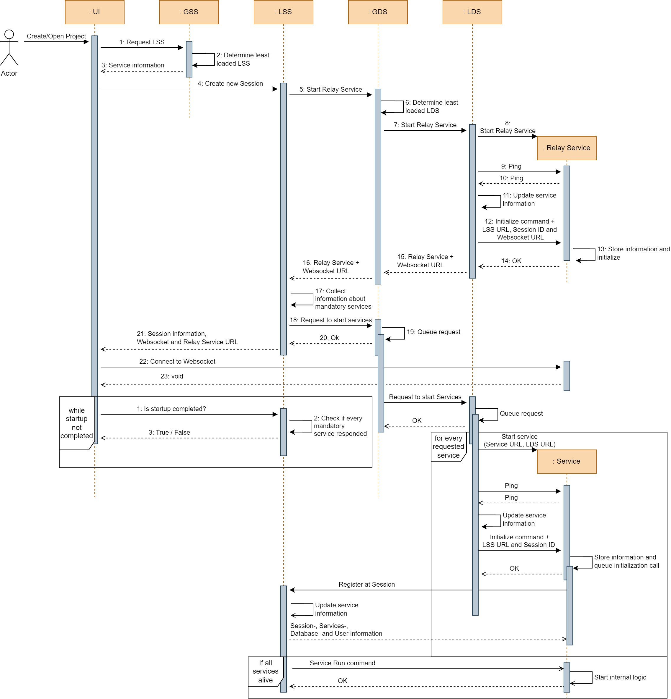

Session Management
==================

For the session management OpenTwin provides four services:

1. Global Session Service (:doc:`GSS </services/global_session_service>`)
2. Local Session Service (:doc:`LSS </services/local_session_service>`)
3. Global Directory Service (:doc:`GDS </services/global_directory_service>`)
4. Local Directory Service (:doc:`LDS </services/local_directory_service>`)

These services handle the startup logic for each session, monitor the running services and try to balance the CPU & GPU load on each node.

================
Create a Session
================

The session creation can be initiated from any service.
Since currently the Frontend Application is the only "Service" that can be started by a user, it is the only possible way to start a Session.

...

