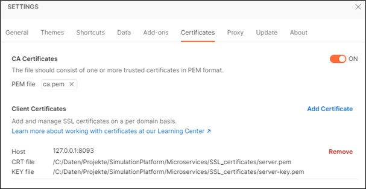

Setting up the development environment
======================================

============
Introduction
============

This manual describes the installation of OpenTwin on Windows 64 Bit systems. The manual is organized in two parts:

-	Installation of OpenTwin for end users
-	Installation of the development environment

It is recommended that you perform the end user installation steps even when you are planning to install the development environment afterward. Following these steps will ensure that all prerequisites such as the database server are installed and configured properly.

The software has been successfully installed and tested on Windows 10 and Windows 11 operating systems. 

.. warning::
    It is highly recommended to follow the path suggestions given in this document, e.g., ``C:\OpenTwin\...``

The drive itself can of course be changed, e.g., ``D:\OpenTwin\...`` but all directories should be at the suggested locations relative to each other. 

.. note::
    In the following, a drive letter **X** will be used throughout the manual which needs to be replaced by your actual drive letter (e.g., C, D, …)

Please ensure that enough disk space is available at the selected drive, e.g., at least 10 GB in case of an end user installation and at least 100 GB for installing the development environment.

.. _Installation of OpenTwin for End-Users:

====================================== 
Installation of OpenTwin for End-Users
======================================

The following sections describe the installation of OpenTwin for end users. The installation depends on whether you want to install and run all server components on your system for local access only or whether you want to allow remote access to the server components. Most of the installation steps are required in both cases and you can simply skip the public setup steps if you want to run the software locally only.

^^^^^^^^^^^^^^^^^^^^^^^^^^^^^^^^^^^^^^^^^^
Installation of OpenTwin Server Components
^^^^^^^^^^^^^^^^^^^^^^^^^^^^^^^^^^^^^^^^^^

The installation of the OpenTwin server components is straight-forward and does not require any particular installation prerequisites. It is sufficient to download the corresponding zip archive, e.g., **OpenTwin_<build date>.zip** and extract it into the installation directory ``X:\OpenTwin\Repo\Deployment``.

The directory will then contain a large number of files. Since the installation of the database server and the database setup are still missing, the software will not be able to run yet.

As a next step, the necessary runtime components need to be installed. Therefore, navigate to the subdirectory “VC_Redist” in the installation directory ``X:\OpenTwin\Repo\Deployment\VC_Redist`` and run the installation program ``VC_redist.x86.exe``.

^^^^^^^^^^^^^^^^^^^^^^^^^^^^^^^^^^^^^^^
Installation of MongoDB Database Server
^^^^^^^^^^^^^^^^^^^^^^^^^^^^^^^^^^^^^^^

The installation of the server components requires a running MongoDB database instance. If you already have a MongoDB instance configured for OpenTwin, you can skip the database installation steps.

The easiest way to install the necessary database server component is to download the MongoDB community edition from the following location: https://www.mongodb.com/try/download/community

Please make sure to select the “Windows” platform and “msi” package. It is highly recommended to use the 4.4 version of the server:

After downloading the installation program, just run the installer and follow the instructions. The mongo Shell, which is necessary to configure the database, is included with the server installation. Please make sure to also install the MongoDB Compass application if you are planning to setup a development environment later.

Once the installation is completed, the server needs to be configured. Therefore, you need to browse to the installation folder of the database server which is usually located at ``C:\Program Files\MongoDB\Server\<server version, e.g., 4.4>``.

This folder contains a “bin” directory where the configuration file is stored:

Now open the configuration file ``mongod.cfg`` in a text editor (e.g., notepad.exe). Please note that will usually be necessary to have administrator privileges in order to edit the file content. Therefore, make sure to run the editor in administrator mode.

.. code-block::
    :emphasize-lines: 8,16,20,21,22,23,24,27

    # mongod.conf

    # For documentation of all options, see:
    #   http://docs.mongodb.org/manual/reference/configuration-options/

    # Where and how to store data.
    storage:
      dbPath: X:\OpenTwin\DataStorage\data
      journal:
        enabled: true

    # Where to write logging data.
    systemLog:
      destination: file
      logAppend: true
      path: X:\OpenTwin\DataStorage\log\mongodb.log

    # Network interfaces
    net:
      port: 27017
      bindIp: 127.0.0.1
    #  tls:
    #    mode: requireTLS
    #    certificateKeyFile: X:\OpenTwin\Repo\Deployment\Certificates\certificateKeyFile.pem

    security:
      authorization: disabled

In a first step, please update the content of the configuration file at the highlighted positions above. This assumes that the database server is running locally on your system, therefore the IP address of the server is set to ``127.0.0.1`` (= localhost). If you are installing the server components on a public IP address, the necessary changes will be explained later in this document. For now, you can proceed by specifying ``127.0.0.1``.

You can simply copy and paste the content above and edit the highlighted parts according to your needs. Please note that the configuration file is a YAML file, which does not use elements like brackets to clarify the data format. Most relations are specified via indentations. The behavior is defined for blanks (spaces), thus tabulators may not work and should therefore be avoided. A subordinate object can be marked as such by using two more spaces in front of it, than the preceding superordinate object has.
Since no database user has been configured yet, the authorization needs to be disabled for now as shown above.

Please double-check whether you have correctly updated the data base location (dbPath), the logfile path (path), the network settings (port, bindIp, tls mode, tls certificateKeyFile), and the security (authorization).

If everything is correct, you should now restart the database server. Therefore, open the services control panel (e.g., Windows-R key to open the command line, enter services.msc and press the return key). 

Search for the service named “MongoDB Server (MongoDB):

.. image:: images/mongodb_service.jpg
    :scale: 100%

Right-click on the corresponding line and select “Restart” from the context menu. Afterward, ensure that the server is running by checking its “Status” field. If the server is not running, most likely there is a mistake in the configuration file, so please double-check the file content.

In a next step, the database has to be configured. This can be done by using the Mongo-Shell which is contained in the same directory as the server executable (see above), e.g., ``C:\Program Files\MongoDB\Server\<server version, e.g., 4.4>\bin``.

The shell can be opened by double-clicking on the file ``mongo.exe``:

Now, a user for database administration needs to be created. Therefore, type or copy the following code from below and paste it into the Mongo Shell by pressing the right mouse button. Finally press the return key:

.. code-block::

    use admin
    db.createUser({
        user: "admin",
        pwd: "admin",
        roles: [
        { role: "root", db: "admin" },
        { role: "dbOwner", db: "ProjectTemplates" },
        { role: "dbOwner", db: "ProjectsLargeData" },
        { role: "dbOwner", db: "System" },
        { role: "dbOwner", db: "UserSettings" },
        { role: "dbOwner", db: "Projects" }]
    })

In a next step, the authentication should be enabled for the data base. Therefore, edit the database server configuration file as shown below (switch the authentication to enabled and remove the comment signs “#” in front of the lines related to configuring the TLS security):

.. code-block::
    :emphasize-lines: 22,23,24,27

    # mongod.conf

    # For documentation of all options, see:
    #   http://docs.mongodb.org/manual/reference/configuration-options/

    # Where and how to store data.
    storage:
      dbPath: X:\OpenTwin\DataStorage\data>
      journal:
        enabled: true

    # Where to write logging data.
    systemLog:
      destination: file
      logAppend: true
      path: X:\OpenTwin\DataStorage\log\mongodb.log>

    # Network interfaces
    net:
      port: 27017
      bindIp: 127.0.0.1
      tls:
        mode: requireTLS
        certificateKeyFile: X:\OpenTwin\Repo\Deployment\Certificates\certificateKeyFile.pem

    security:
      authorization: enabled

Afterward, restart the database server as described above and ensure that the server is running properly.

For secure connections to the database, a certificate authority is necessary to validate the certificates. In order to store the root certificate in the certificate store, you can open a command shell in administrator mode and run the following command:

.. code-block::

    certutil -addstore root X:\OpenTwin\Repo\Deployment\Certificates\ca.pem

.. _Installation of the OpenTwin Server Components for Network Usage:

^^^^^^^^^^^^^^^^^^^^^^^^^^^^^^^^^^^^^^^^^^^^^^^^^^^^^^^^^^^^^^^^
Installation of the OpenTwin Server Components for Network Usage
^^^^^^^^^^^^^^^^^^^^^^^^^^^^^^^^^^^^^^^^^^^^^^^^^^^^^^^^^^^^^^^^

In case that you want to be able to access the server components from other computers in the network remotely, you need to configure the setup properly. If this is not the case and everything shall be installed on your personal computer locally, you can simply skip this section.

OpenTwin requires two mandatory services to be run on the server: the authentication service and the session service. The authentication service handles user credentials and manages access privileges to projects. The session service manages all other services and handles the creation of sessions when a user logs on to the system.

If you want to use a public IP address (e.g., 182.0.0.1) rather than the localhost (127.0.0.1), you need to set a number of environment variables on the system as described below.

Set the environment variable ``OPEN_TWIN_SERVICES_ADDRESS`` to the public IP address where the services (including the session service should run), e.g., 182.0.0.1 (please note that the default address is 127.0.0.1 if ``OPEN_TWIN_SERVICES_ADDRESS`` is not set).

Since all communication in OpenTwin is protected via TLS, server certificates need to be created for the public server IP address. These certificates need to be created only once and should therefore be stored outside the actual installation folder of the software. This will ensure that the certificates are not overwritten when the software is updated. Please create an empty directory to store the certificates outside the installation folder, e.g., ``X:\OpenTwin\Certificates``.

Afterward set the environment variable ``OPEN_TWIN_CERTS_PATH`` to the path to this certificates folder. Once this is done, the actual creation of the server certificates can be triggered by calling the shell ``createCertificate.bat`` which is located in the **Certificates** subfolder of the installation directory. This will create a new set of certificates for the public server IP address.

The database server needs to be configured to use the public IP address. Therefore, edit the ``mongod.cfg`` configuration file again as explained above. 

   .. code-block::
       :emphasize-lines: 3,4,7

        # Network interfaces
        net:
        port: <your mongoDB server port, e.g., 27017>
        bindIp: <your public IP address>
        tls:
            mode: requireTLS
            certificateKeyFile: <Path to your server certificate file, e.g., C:\OpenTwin\Certificates\certificateKeyFile.pem>
        
Here you need to change the IP and port settings to match your public IP as selected above. Furthermore, update the path to the certificateKeyFile such that it points to the newly created server certificate. Afterward, restart the MongoDB database server as described above and ensure that it is running properly.

Set the environment variable ``OPEN_TWIN_MONGODB_ADDRESS`` to the IP address of the MongoDB server including an initial “tls@”, e.g., ``tls@127.0.0.1:27017`` (please note that this is default address if ``OPEN_TWIN_MONGODB_ADDRESS`` is not set).

Set the environment variable ``OPEN_TWIN_AUTH_PORT`` to the port which should be used for the authentication service, e.g., ``8092`` (please note that this is default port if ``OPEN_TWIN_AUTH_PORT`` is not set). This port number should be lower than the one for the local session service below to avoid port conflicts with dynamically created services which might slow down the launching of the services.

Set the environment variable ``OPEN_TWIN_GSS_PORT`` to the port which should be used for the global session service, e.g., ``8091`` (please note that this is default port if ``OPEN_TWIN_GSS_PORT`` is not set). This port number should be lower than the one for the local session service below to avoid port conflicts with dynamically created services which might slow down the launching of the services.

Set the environment variable ``OPEN_TWIN_LSS_PORT`` to the port which should be used for the local session service, e.g., ``8093`` (please note that this is default port if ``OPEN_TWIN_LSS_PORT`` is not set). All other services will get port numbers assigned starting from this number, e.g., 8094, 8095, etc.

Set the environment variable ``OPEN_TWIN_GDS_PORT`` to the port which should be used for the global directory service, e.g., ``9094`` (please note that this is default port if ``OPEN_TWIN_GDS_PORT`` is not set). 

Set the environment variable ``OPEN_TWIN_LDS_PORT`` to the port which should be used for the local directory service, e.g., ``9095`` (please note that this is default port if ``OPEN_TWIN_LDS_PORT`` is not set). 

Set the environment variable ``OPEN_TWIN_SITE_ID`` to the ID which should be used for the current site, e.g., ``1`` (please note that this is default site ID if ``OPEN_TWIN_SITE_ID`` is not set).

.. _Running OpenTwin and Creating a User Account:

^^^^^^^^^^^^^^^^^^^^^^^^^^^^^^^^^^^^^^^^^^^^
Running OpenTwin and Creating a User Account
^^^^^^^^^^^^^^^^^^^^^^^^^^^^^^^^^^^^^^^^^^^^

The frontend of the application can be started via the ``OpenTwin_local.bat`` shell in the installation directory. This shell will automatically run the server components (authentication and session services) locally if necessary. 
The application should then show the login screen:

The first step is to configure the server to be used. Therefore, click in the **Session service** field and choose **Edit**. 

In the upcoming dialog box, press the **Add** button to enter a new server configuration. If you have used the default settings, the session server will run at the IP address ``127.0.0.1`` and port number ``8091``. You should specify a name, e.g., **Local** for the configuration. 

Finally, press **Close** to dismiss this dialog box. Back in the login screen, you can now specify a new username and your password:

 
Since this user is not known to the system yet, you can create a new account by clicking on **New user? Register** which will open the following dialog box:
 

Here you need to re-type your password and press the **Create** button. Afterward, you can simply login with your credentials:

====================================================
Installation of the OpenTwin Development Environment
====================================================

It is recommended to perform the steps described in section `Installation of OpenTwin for End-Users`_ for use on the local system before proceeding with the installation of the development environment.
Once a working local installation of OpenTwin is available on the system, you can proceed with the next steps.

^^^^^^^^^^^^^^^^^^^^^^^^^^^^^^^^^^^^^^^^^^^^^^^^^^^^^^^^^^
Install Development Tools Required for Developing OpenTwin
^^^^^^^^^^^^^^^^^^^^^^^^^^^^^^^^^^^^^^^^^^^^^^^^^^^^^^^^^^

Please install the following toolchains:

**Install Microsoft Visual Studio 2022** and make sure to install the C++ compilers as well (Desktop Development with C++). The build system relies on this particular compiler version, so please install exactly this version of Visual Studio.

**Install Git**: https://git-scm.com/download/win

Optionally you can **install a graphical Git frontend**, e.g., GitHub Desktop: https://desktop.github.com or SmartGit (https://www.syntevo.com/smartgit).

**Install the MongoDB Compass** application if this has not already been done together with the server installation (https://www.mongodb.com/try/download/compass). Please make sure to install the 1.28.1 version of the application.

**Install Rust**: Download and run the installer for 64 Bit Windows (``rustup-init.exe``) from https://rust-lang.org/tools/install.
The latest stable build can be obtained and activated by executing the following commands in a command shell:

.. code-block::

    rustup install stable latest
    rustup default stable latest
    rustup update
    
The version displayed by the last command should then be 1.56.1. It is best if you stick with version 1.56.1 and don’t use a more recent version. 

**Install PostMan**: The PostMan software can be downloaded from the following location: https://www.postman.com/downloads. Please make sure to use the Windows 64-bit version of the tool and follow the instructions of the installation software.

**Install Node.js** (https://nodejs.org), latest stable version, into the default installation folder.

**Install “yarn”** via opening a command shell and executing the following code: ``npm install --global yarn``

**Install Python**: If you do not have a Python 3 interpreter installed yet, you can visit https://www.python.org/downloads/ and download / install the latest version for Windows from there. 

**Install Sphinx**: Sphinx and the "Read the docs" theme are required for building the documentation. You can install both of them via the Python tool pip. Just open a command window and enter the following commands:

.. code-block::

    pip install -U sphinx
    pip install -U sphinx_rtd_theme

^^^^^^^^^^^^^^^^^^^^^^^^^^^
Clone the GitHub Repository
^^^^^^^^^^^^^^^^^^^^^^^^^^^

Clone the Github repository: https://github.com/pth68/SimulationPlatform  to your local source code directory ``X:\OpenTwin\Repo``.

.. note:: 
    Due to the size of this repository, the cloning operation may take a while depending on your internet connection speed.

Change the directory into the folder of the admin panel: ``X:\OpenTwin\Repo\Microservices\AdminPanel`` and execute the following code:

.. code-block::

    yarn install

.. _Configure the Environment:

^^^^^^^^^^^^^^^^^^^^^^^^^
Configure the Environment
^^^^^^^^^^^^^^^^^^^^^^^^^

Set the following Windows environment variables: 

- ``DEVENV_ROOT_2022`` = The path to your Visual Studio 2022 installation (e.g.: ``C:\Program Files\Microsoft Visual Studio\2022\Community\Common7\IDE``)
- ``OPENTWIN_DEV_ROOT = X:\OpenTwin\Repo``

The ``OPENTWIN_DEV_ROOT`` environment variable must point to the directory that looks this:

.. image:: images/repo_folders.jpg 

 
Now set up the Qt plugin for Visual Studio by performing the following steps:

#. Enter into one of the project directories, e.g., ``X:\OpenTwin\Repo\Libraries\uiCore`` and open the IDE by double-clicking on the ``edit.bat`` shell.
#. In Visual Studio go to: **Tools->Extensions and Updates**.
#. Select the “Online” category and search for: **Qt Visual Studio Tools**.
#. Download and install this extension. Now Visual Studio must be restarted, please follow the steps described in point 1. again.
#. Wait for the plugin to load.
#. On the toolbar go to: **Qt VS Tools->Qt Versions**.
#. At Qt->Versions add: ``Version name = 5.11.2`` and set the path to the path of the Qt installation in the Repository: ``X:\OpenTwin\Repo\Third_Party_Libraries\Qt\5.11.2\msvc2017_64.``
#. Make sure to select this version as the **default** by checking the box in front of it.
#. Press the **OK** button to close the Dialog.

^^^^^^^^^^^^^^^^^^^^^^^^^^^
Build the OpenTwin Software
^^^^^^^^^^^^^^^^^^^^^^^^^^^

The source code folder contains a **MasterBuild** directory which contains all build tools. Please navigate to this directory and execute the ``buildAll.bat`` shell. 

.. note:: 
    Please note that compiling the software may take some time. 

After the build is finished, you should check the content of the file ``buildLog_Summary.txt`` in the Master Build directory. Please ensure that this file shows 0 failed project builds. Afterward, please execute the ``createDeployment.bat`` shell from the MasterBuild directory. 

This will delete and recreate the Deployment directory from scratch. In case of minor changes, it might be sufficient from now on to execute the shell ``updateDeploymentLibrariesOnly.bat`` which performs an incremental update of some parts of the Deployment directory. However, in case of larger changes, a full recreation of the directory is necessary.

Please note that the deployment folder created by this execution overwrites the deployment folder created by following the steps in section `Installation of OpenTwin for End-Users`_. Keep in mind, that any code changes introduced by you or any code changes pulled from the github repository will only effect the deployment folder within the repository.

When you execute the build process for the first time, new certificates will be created and stored in the Deployment directory. Therefore, you need to update the certificates store by using the following command:

.. code-block::

    certutil -addstore root X:\OpenTwin\Repo\Deployment\Certificates\ca.pem

If you are using a public IP address rather than ``127.0.0.1``, it is also necessary to re-create the certificates for this IP address after the first build takes place. Therefore, just delete the certificates in the **Certificates** folder referred to by the environment variable ``OPEN_TWIN_CERTS_PATH`` and re-create the certificates as described in section `Installation of the OpenTwin Server Components for Network Usage`_.

Following the initial build of the software after pulling the source code from the repository (or whenever the certificates are re-generated), it is recommended to restart the MongoDB server as described above to ensure that the server uses the latest certificates.

Once these steps are completed, you should have a valid installation of the software in the Deployments folder. The software can then be used in the same way as described in section `Running OpenTwin and Creating a User Account`_.

^^^^^^^^^^^^^^^^^^^^^^^^^^^^^^^^^^^^^^^^^^^^^^^^^^^^^^^^
Configure the Postman Software for Testing and Debugging
^^^^^^^^^^^^^^^^^^^^^^^^^^^^^^^^^^^^^^^^^^^^^^^^^^^^^^^^

The certificates need to be configured in Postman for debugging the microservices:

Here you need to specify the ``ca.pem`` file as CA certificate. This file can be found in the certificate subdirectory
``X:\OpenTwin\Repo\Microservices\SSL_certificates``.

For the client certificates, you need to specify the CRT file and the KEY file. The CRT file is the ``server.pem`` file in the certificate subdirectory (see above). The KEY file is the ``server-key.pem`` file in the same directory.

For the host you have to enter the IP and Port of the local session service. If the service runs locally the IP is ``127.0.0.1`` and the default port is ``8093``. Section `Installation of the OpenTwin Server Components for Network Usage`_ shows how the default can be changed for network usage. Such changes have to be considered for the postman settings as well.

Afterward, you can import the collection of useful messages from the file ``X:\OpenTwin\Repo\Documentation\PostMan Collection\ SessionService.postman_collection.json``.

.. warning::
    Here, the destination IP and Port must be changed accordingly, too - if the default settings were changed.

======================
Developing in OpenTwin
======================

OpenTwin is a software platform that uses a so-called micro-service architecture. A micro-service framework, written in the programming language Rust runs multiple services. Each service is an independent compilation unit and communicates with the other services via https. If a service shall be debugged, it is necessary to start the session service via the script file: ``X:\OpenTwin\Repo\Deployment\OpenTwin_session.bat``

Subsequently, you can open Postman and set the desired service to debugging mode. If successful, the corresponding post message will get a “1” as response. Now OpenTwin can be started via the script file: ``X:\OpenTwin\Repo\Deployment\OpenTwin_localUI.bat``

Log in with your credentials and select a project. The Frontend will now remain in a waiting state until the service that is set into debugging state, is started from Visual Studio in debug mode. Opening the corresponding service within Visual Studio must happen exclusively via the ``edit.bat`` within the folder of the service.

.. note:: 
    We highly recommend that you work with Visual Studio (not Visual Studio Code or any other IDE). 

For various reasons, we recommend that you to follow the practice of continuous integration. That means that you should push your changes frequently so that everyone is working on an up-to-date version of the source code and merge problems can be avoided.
When you made any changes to OpenTwin and you wish to push them into the online repository, please follow the following steps:

#. Make sure that your code builds successfully
#. Make sure that your code did not introduce new warnings
#. If already available: Make sure that the unit tests of the changed services all pass
#. Execute the ``buildAll.bat`` and ``createDeployment.bat``. Check, if everything was successful
#. Try to execute OpenTwin
#. Now, you can push your changes

Usually several parties develop on OpenTwin simultaneously, so make sure that you are working always with an up-to-date version. Before you start with your work, pull the repository, execute ``buildAll.bat`` and ``createDeployment.bat``.

 
============ 
Known Issues
============ 

^^^^^^^
MongoDB
^^^^^^^

Even if it was not possible to establish the connection to MongoDB, the session, authorization and UI service can launch. If during the log-in procedure unexpected error messages regarding the user settings occur, it may be related to the connection to MongoDB. First steps to debug this situation are to check amongst the Windows service, if MongoDB is running and connecting to it via MongoDB Compass.

Known issues that are caused by certain MongoDB versions and or Compass versions are:

- MongoDB Compass version 1.31 is known to have communication issues with the community version of MongoDB. Specifically, the TLS encrypted connection may not work. A version that is known to work and contains advanced settings via which the TLS connection can be selected, is version 1.28.1
- The TLS secured connection with MongoDB version 5.0 had some problems for the remote setup (if MongoDB is running on another IP than localhost). Trying to connect via Compass to MongoDB will lead to the error “Hostname/IP does not match certificate’s altnames”. This behavior does not occur with MongoDB version 4.4. 
- “Hostname/IP does not match certificate's altnames” appears when trying to connect to MongoDB via Compass. This can be solved by checking the service properties and setting the log on property to “local system account”.

^^^^^^^^^^^^^^^^^^^^^^^^^^^^^^^^^^^^^
Developing on a remote server via RDP 
^^^^^^^^^^^^^^^^^^^^^^^^^^^^^^^^^^^^^

On a server that is not equipped with an OpenGL 3 compatible graphics card the UI-frontend is not working. This is the case, for instance on the FRA-UAS HPC server. In this case, the ``localUI.bat`` shell will close directly after starting. To make OpenTwin work in this environment, it is necessary to rename the ``opengl32sw.dll`` file in the deployment folder to ``opengl32.dll``. This will force a Mesa-based OpenGL software rendering.

^^^^^^^^^^^^^^^^^
Rust build errors
^^^^^^^^^^^^^^^^^

If the Rust components fail to build (with strange error messages) it often helps to delete the ``Cargo.lock`` file (located at: ``X:\OpenTwin\Repo\Microservices\OpenTwin``). After deleting the file and building the repository again, Rust will fetch all required libraries again and download the latest version of each library.

^^^^^^^^^^^^^^^^^^^^^^^^^^^^^
No buildlog files are created
^^^^^^^^^^^^^^^^^^^^^^^^^^^^^

To build the OpenTwin project, the ``buildAll.bat`` shell in the **MasterBuild** directory must be used. This script runs Visual Studio via command line arguments and builds all microservices in both debug and release mode. If no ``buildLog_*.txt`` files are created in the **MasterBuild** directory or if they are empty, this is an indication that either one of the environment variables is set incorrectly or that there is a problem with Visual Studio. Section `Configure the Environment`_ describes how to set the environment variables correctly. Make sure that they point to the right directories. 

Since Visual Studio is used to build the project, you need to make sure that it works. Check that you can open a project via the ``edit.bat`` shell script and build it within Visual Studio.

^^^^^^^^^^^^^^^^^^^^^^^^^^^^^^^^^^^^^^^^^^^^^^
Multiple error messages if a project is opened
^^^^^^^^^^^^^^^^^^^^^^^^^^^^^^^^^^^^^^^^^^^^^^

Most likely you did not open the project via the ``edit.bat`` file. This file sets certain environment variables for the include paths. If you opened the project via the ``edit.bat`` and you still get errors, try to pull the repository and make sure that the pull was successful. If this is also the case, ask your team members if the problem also occurs with others or if it has something to do with your computer.

 
