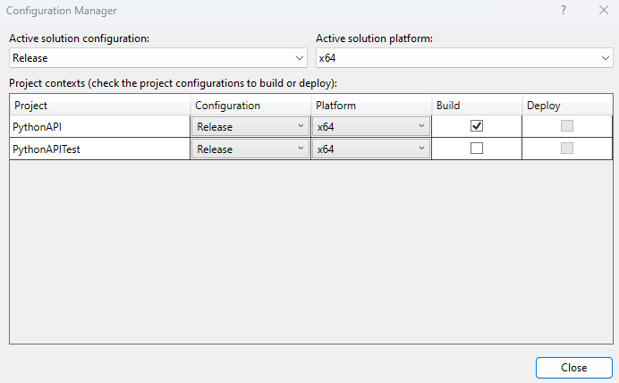
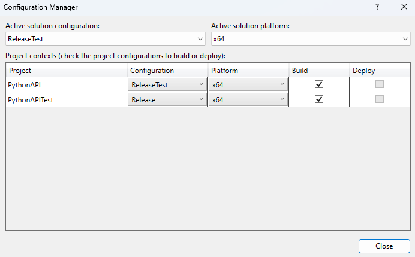

Create a new library
====================

The purpose of a library is to encapsulate functionality, so that other libraries and services may use it. 

.. warning::
    Look out for circular dependencies, which must be avoided. For a better understanding of the dependencies, study the :ref:`package overview<target Package Overview>`

A library cannot be executed, in contrast to services. All libraries are located in OpenTwin/Libraries. For creating a new labrary perform the following steps:

   #. Create a new, empty C++ project in Visual Studio named <ProjectName>
   #. In the project folder, create the two folders `include` and `src`
   #. Open the project and open the project properties
   #. Select `Configuration`->`All Configurations` and `Platform`->`x64`
   #. Change `Configuration Properties`->`General`->`Configuration Type` to `Static Library`
   #. Change  `Configuration Properties`->`Advanced`->`Target File Extension` to `.lib`
   #. In `C/C++`->`General`->`Additional Include Directories` add `$(SolutionDir)include`

.. note:: If the `C/C++` category, simply add a cpp file to the project and the category will appear
.. note:: When adding files to the project, take care that the file path is <ProjectName>/src for cpp files and <ProjectName>/include for header files.

Setting up the test project
---------------------------
Open Twin uses the gtest library for unit testing. For details regarding unit tests, look into (...).
The tests themselves are created in a second, executable project which links the project that shall be tested. Developing a library test driven will not only ensure that the libraries API is clearly defined, but it also helps while developing since a .lib cannot be executed.
    
    .. note:: Generally, every OpenTwin library and service shall have a test project

To create the test project follow these steps:

   #. Create another new, empty C++ project <ProjectName>Test but this time, create no new solution 
   #. In the <ProjectName>Test folder, create the two folders `include` and `src`
   #. Open the project and open the project properties.
   #. Select `Configuration`->`All Configurations` and `Platform`->`x64`
   #. In `C/C++`->`General`->`Additional Include Directories` add `$(SolutionDir)include`, `$(ProjectDir)include` and  `$(GOOGLE_TEST_INC)`
   #. The linker settings are build configuration depending. Thus, select after another the `Debug` and `Release` configuration and add the following paths with `D` as an ending for the debug paths and `R` as an ending for the release paths 
   #. In `Linker`->`General`->`Additional Library Directories` add `$(GOOGLE_TEST_LIBPATHD)` and `$(<Project environmentvariable>)\(OT_LIBTESTD)`
   #. In `Linker`->`Input`->`Additional Dependencies` add `$(GOOGLE_TEST_LIB)` and `<ProjectName>.lib`
   #. Close the test project and open the .sln file in the project directory
   #. Both project and test project should be listed
   #. In the topline of Visual Studio, there is an option to select the build configuration (Debug or Release) and the build target (x64). Select the build configuration and open the `Configuration Manager`
   #. In `Active solution configuration` create two new settings: `ReleaseTest` and `DebugTest`
   #. If the option `Create new project configurations` was selected, remove the new configurations from the test project; ultimately, only the project shall have the two additional settings
   #. Select the regular debug/release settings for the project and deselect the build option for the test project
   #. Select the test build configurations and set the project build configurations so that e.g. for the `DebugTest` solution setting, the project uses `DebugTest` and the test project uses `Debug` 
   #. In the test project setting, choose `Build Dependencies`->`Project Dependencies` and select the project as dependency
   #. In `C/C++`->`Code Generation`->`Runtime Library` take care that `Multi-threaded Debug DLL` is selected for the `DebugTest` setting of the project

Connecting the project with OpenTwin
------------------------------------
OpenTwin uses a bunch of environment variables that point to the project directories. This ensures maximal flaxibility with the overall repo structure.
For that reason, use the defined environment variables whenever possible.
To fit the new library into the OpenTwin structure, perform the following steps:
 Create an environment variable in OpenTwin/Scripts/SetupEnvironment.bat that points to the library root (This variable is used in linker path of the test project)
    #. Copy the build.bat, clean.bat, edit.bat and test.bat from any service or library into the new library folder
    #. Edit ALL the batch files to point to the new library 