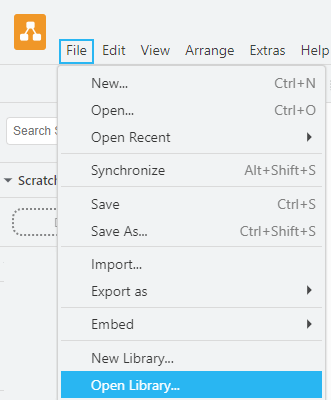

Create UML diagrams
###################

For UML class and sequence diagrams `draw.io <https://www.drawio.com/>`_ should be used (`Download here <https://get.diagrams.net/>`_).
Use the libraries provided by OpenTwin to use the predefined elements.

To add the libraries open the `draw.io application <https://get.diagrams.net/>`_, and navigate to ``File/OpenLibrary`` in the menu bar to import the libraries located at ``<OpenTwin root>/OpenTwin/Documentation/Draw.io_Libraries``.

