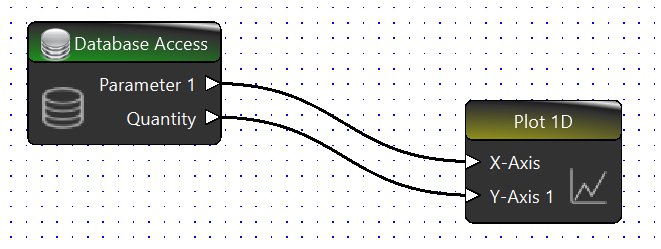

Data Processing Service
=======================

The data processing service uses a block editor to let the user assemble a custom data pipeline 
which then can be excecuted. Its main motivation is the post processing of data from the result collection, which can be created from the :ref:`import parameterized data service<ImportParameterizedDataService>`.
The block editor for the Data Processing Service can be accessed via the "Data Processing" tab. Single blocks can be selected from the Block Picker window and added to the editor via drag and drop. If the Block Picker window is not displayed, it can be added through the Windows option in the View Menu.
A simple data pipeline looks as follows:

Processing blocks have connectors which are in this case the triangles at the edges of the block. The direction of the triangles symbolises the direction of the data flow. By selecting one connector by a double-click, a connection can be drawn. 
It is only possible to connect an data-in-connector with an data-out-connector. It is possible to add arbitrarily many connections to a data-out-connector. Connecting an in-data-connector multiple times is not allowed and will interrupt the pipeline execution. 
White in-data-connector symbols are mandatory. If not all mandatory in-data-connectors of a block receive a connection, the block is scipped in the pipeline execution. Each block has properties, which can be edited in the OpenTwin manner from the properties window. Incomplete properties or not matching data formats are displayed in the output window when the pipeline is executed. The execution can be started with the run button in the Data Processing menu tab.

Block Types
-----------
Currently some basic blocks for the data processing of the result collection are provided.

Database Access
^^^^^^^^^^^^^^^
The database access bock is a plain data source. Through the project name property, the data set of the selected project can be accessed. The name selections of the quantity and parameter settings are then corresponding to available meta data from the selected project. It is additionally possible to increase the output dimension via the same named property. A 1D outcome dimension only forwards the queried quantity and a single parameter. 
By increasing the query dimension, it becomes possible to query for more parameter and forward their values in the data pipeline.

Matrix Element Selection
^^^^^^^^^^^^^^^^^^^^^^^^
The data format is currently not visualized but blocks are displaying a corresponding message, if the format is not matching. Touchstone files are stored as matrices of s-parameter in correspondance to the parameter settings. Querying a dataset that is created from a touchstone file will require the selection of a matrix index before forwarding it to a plot 1D block.

Plot 1D
^^^^^^^
This block takes a one-dimensional data struct as input for the x-axis and y-axis respectively. It is mandatory to give the curve a name via the blocks property. It is also possible to add multiple curves to one plot by increasing the number in the corresponding property. By changing the number, the block visualisation will adapt and increase or decrease the number of in-data-connectors for y-axis values.
Only a single x-axis data input is possible.

Display
^^^^^^^
The display block takes data of any format and plots them in the output window.

Python
^^^^^^
With the python block, it becomes possible to execute custom code within the pipeline. The block has initially only one property that allows the selection of one loaded python script. This script can define additional properties and block connectors as seen in the following script example:

.. code-block:: Python
    :linenos:
    :caption: UpdateSelectionWithNextRow.py
    
    #@ Port : {"type": "in", "name": "S_Parameter", "label" : "S Parameter Matrix"}
    #@ Port : {"type": "out", "name": "ZParameter", "label" : " Nodal Z-Parameter"}
    #@ Property : {"label" : "Reference Impedance","type" : "double", "default" : 50.0}
    import OpenTwin 
    import numpy as np

    def BuildIdentityMatrix(dimension):
	    return np.identity(dimension)

    def __main__(this):
        Sse = OpenTwin.GetPortData("S_Parameter")[0]
        matrixShape = Sse.shape
        I = BuildIdentityMatrix(matrixShape[0])
        Z0 = 50
        Zn = Z0 * np.linalg.inv(I - Sse)*  I+Sse
        OpenTwin.SetPortData("ZParameter",Zn)

All block definitions have to be listed at the beginning of the python script and they require an initial "#@".
Afterwards it is defined, if a port or property is described. Ports require the following:

* Type: {"in", "out", "inopt"}.
* Name: Name for the usage in the script
* Title: Text that is displayed at the connector in the block

The property definition requires the following:

* Label: Name that is being displayed in the property grid
* Type: {"selection", "string", "double", "integer", "boolean"}
* Default: Optional setting for a default value
* Options: Required, if the property is of type selection. This setting defines the list of possible strings that are offered as a selection

Data that the python block receives through a port or passes on through a port can be set with the corresponding OpenTwin Module functionality GetPortData, respectively SetPortData.