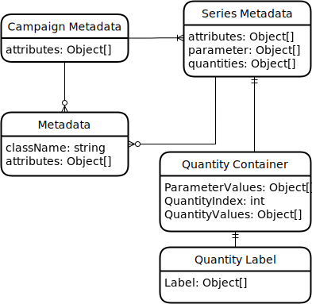
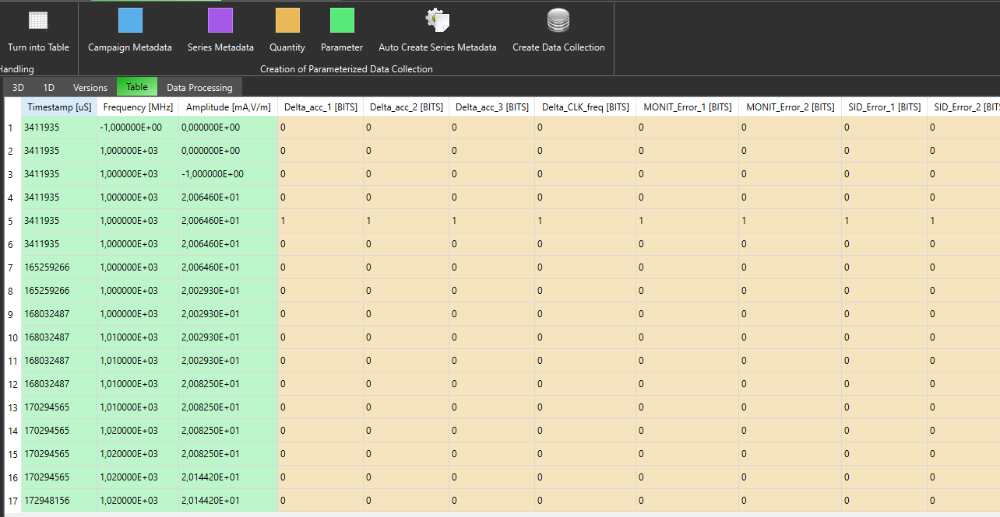

Import Parameterized Data Service
=================================
.. _ImportParameterizedDataService:

The import service is used for importing large data amounts like simulation or measurement data. The measured or simulated data is stored in a separate collection with the same name and an ".result" extension.
The data can then be accessed via their metadata, which are stored in the regular collection. The data model looks as follows:

   
*Quantity Container entities:*
Contain measured or simulated values and are stored in a separate data lake. They can be accessed via their metadata, which are stored in two hierarchical levels, describing a series of data acquisitions, e.g. a measurement series, or an entire campaign, e.g. a measurement campaign. 

*Campaign Metadata and Series Metadata:*
Both hold a list of attributes of any type. Series Metadata entities have additional fields to store metadata about the measured or simulated quantities and the parameters of that measurement or simulation. More complex or shared information can also be stored in separate Metadata entities.

*Quantity Label:*
Such labels can be used for machine learning methods that require labelled data, such as supervised training of a neural network or to mark a measurement as an outlier. Furthermore, it is also possible to label entire series or campaigns by adding appropriate entries to their attribute list. 

Data import from a csv file
--------------------
The import via csv files shall act as interface to any kind of data format. It is up to the user to transform data from any other format into a csv format that can be interpreted by OpenTwin. Following the workflow is described how data, originating from a csv file can be imported, analysed and stored in the described data model. 
All described features can be executed via buttons in the *Import Parameterized Data* menu tab.

Table import
^^^^^^^^^^^
First the csv file needs to be imported as plain file. OpenTwin tries to detect the text encoding and shows it in one of the file entity properties. This is important since MongoDB supports only UTF-8 encoding and OpenTwin has to perform a encoding conversion if necessary. The file entity also allows the selection of row and column delimitter. After checking the settings selected files can be turned into tables.
For performance reasons only a section of the table will be shown. The displayed range can be adjusted via the table entity properties. Additional it is possible to switch the header position between first row and first column. This is important for the following selection interpretation. The table content is displayed as text. It is up to the user to select the correct decimal point character in the table property.

Data characterisation
^^^^^^^^^^^^^^^^^^^^^
The next step is the characterisation of the data from the table. It is not possible to interprete automatically if a given data set is a quantity, parameter or just general meta data. This must be done by the user by selecting sections of the Table and characterising them with a click on one of the buttons *Campaign Metada*, *Series Metadata*, *Quantity*, *Parameter*.

In this example the three columns on the right are selected as parameter and the remaining columns as quantities.
The selection is then shown as an entity in the navigation tree. With its properties it is possible to select a data type. Since the displayed table is only a selection of the entire table, the user can select if the entire column or row shall be selected with the corresponding properties. If no series metadata is selected in the navigation tree while chategorising a table selection, a new series meta data entry is added. 

Batching of Selections
^^^^^^^^^^^^^^^^^^^^^
It is possible to use defined selection as the base for the automised creation of new selections, which will be part of a new series metadata. This feature can be started with the button *Auto Create Series Metadata*. If this feature is started, all selections that have the box *Consider for batching* ticked are being copied into a new series meta data. Afterwards they are altered by the selected python script which can selected with the *Update script* property. Some example scripts:

.. code-block:: Python
    :linenos:
    :caption: UpdateScriptNextRow.py

    import OpenTwin

    def Update(this):
        topRow = OpenTwin.GetPropertyValue(this,"Top row")
        bottomRow = OpenTwin.GetPropertyValue(this,"Bottom row")
        
        setSuccess = OpenTwin.SetPropertyValue(this,"Top row",topRow+1)
        setSuccess = OpenTwin.SetPropertyValue(this,"Bottom row", bottomRow+1)
        
        flushSuccess = OpenTwin.FlushEntity(this)

Here the this parameter is heavily used. It references to the newly created selection entity. With the OpenTwin module it is possible to get property values of this entity, manipulate them and override the values of the entities properties afterwards. In this case, the buttom row and top row of the selection are increased by one.

.. code-block:: Python
    :linenos:
    :caption: UpdateScriptNextTable.py

    import OpenTwin

    def find_nth(haystack, needle, n):
        start = haystack.find(needle)
        while start >= 0 and n > 1:
            start = haystack.find(needle, start+len(needle))
            n -= 1
        return start

    def __main__(this):
        prefixEnd = find_nth(this,"/",3)
        prefix = this[0:prefixEnd]
        rowReference = prefix + "/Prüfnr."
        currentRow = OpenTwin.GetPropertyValue(rowReference,"Top row")
        
        originalTableName = OpenTwin.GetPropertyValue(this,"Table name")
        cellValue = OpenTwin.GetTableCellValue("Tables/Pruefmatrix_SMA8_Ausschnitt",currentRow,0)
        newTableName = "Tables/SMA8_" + cellValue + "_FA"
        OpenTwin.SetPropertyValue(this,"Table name",newTableName)
        OpenTwin.Flush()

This example is a bit more complex. The target is to update the table that is referenced by the selection. To that purpose we assemble the name of another selection entity in row 11 - 13.
The entity lays at the same level as the newly created one with the only difference that it is called "Prüfnr.".
Afterwards we load the value of the selected row from the supporting selection and the referenced table from the newly created selection. 
Then the cell value of a certain table is extracted, based on the selected row of the supporting selection. This cell value gives us the needed part of the desired table name that the newly createed selection shall reference to. 

Concretely, this example was used for data that was stored in tables with the naming convention *SMA8_XXX*. The XXX stands for a test number (Prüfnummer). 
A list with all test numbers is contained in the table *Pruefmatrix_SMA8_Ausschnitt*. The procedure was the following:

1. Make all selections for the first SMA8_XXX table
2. Create selection for the entry with version XXX in the table Pruefmatrix_SMA8_Ausschnitt
3. Add the UpdateScriptNextRow to the selction of the version
4. Add the UpdateScriptNextTable to all selections of SMA8_XXX table
5. Execute the automatic creation
6. The selection of the version will move up to the next version, listed in the table Pruefmatrix_SMA8_Ausschnitt
7. All selections of SMA8_XXX table will be copied and altered so that they point to the next table SMA8_YYY

Create Data Collection
^^^^^^^^^^^^^^^^^^^^^^
By selecting this option all characterised selections are analysed and the selected data is stored in the data base, using the described data model. Selections that were once used are ignored in a subsequent execution of this feature. It is mandatory that each selected quantity entry can get a parameter entry assigned. For that purpose each quantity entry will get setup with all parameter values with the same index. 
I.e. the quantity value in row 4 will be assigned to the values from all parameters in row 4. Each selection will get a name assigned, which is extracted from the table header. The earlier shown image would create parameter with the names Timestamp [uS], Frequency [MHz], Amplitude [mA, V/m]

Import from touchstone file
---------------------------
The import via a touchstone file does not require much interaction. Touchstone version 2.0 is not supported, yet.
A dialog will insure that the correct number of ports is used. The proposal of the number of ports bases on the file ending but since this may not be correct, the user gets the chance to enter a correct number. 
The file parameter: format, frequency unit, parameter and reference resistance are all stored as meta data of the series meta data. This means it is not possible to query a dataset for these file parameters.
The s-parameter are stored matrix wise in a document. 