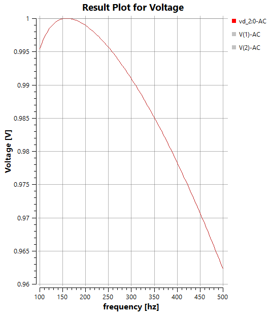

Circuit Simulator
=================
This documentation outlines the test cases for the circuit simulator of our project. 
To ensure that all components of the simulator function correctly, it is important to place elements and connections in different and arbitrary orders. 
This helps identify potential errors or unexpected behavior that may not occur with standardized workflows. 
The test cases therefore cover various configuration possibilities to ensure a comprehensive validation of the system.
Also it is important to test all test cases with and without the GND Element such that always the correct results are obtained.

DC Simulation 
-------------

Voltage Divider Circuit
^^^^^^^^^^^^^^^^^^^^^^^

    

.. list-table::
   :header-rows: 1

   * - Component
     - Value
     - Description
   * - Voltage Source
     - 100 V
     - DC Voltage Source
   * - Resistor R1
     - 200 Ohm
     - -
   * - Resistor R2
     - 200 Ohm
     - -
   * - GND
     - -
     - Ground
   * - Voltage Meter
     - -
     - Voltage Meter

Solver Properties
+++++++++++++++++
.. list-table::
   :header-rows: 1

   * - Simulation Type
     - Element
     - From
     - To
     - Step
   * - DC
     - Voltage Source
     - 0
     - 100
     - 10

   The graph shows that when two equal resistors are used in a voltage divider, 
   the resulting voltage is half of the swept voltage, 
   resulting in a linear relationship where Voltage = 0.5 * swept voltage.

    

Current Divider Circuit
^^^^^^^^^^^^^^^^^^^^^^^

.. list-table::
   :header-rows: 1

   * - Component
     - Value
     - Description
   * - Voltage Source
     - 100 V
     - DC Voltage Source
   * - Resistor R1
     - 200 Ohm
     - -
   * - Resistor R2
     - 200 Ohm
     - -
   * - GND
     - -
     - Ground
   * - Voltage Meter
     - -
     - Voltage Meter

Solver Properties
+++++++++++++++++
.. list-table::
   :header-rows: 1

   * - Simulation Type
     - Element
     - From
     - To
     - Step
   * - DC
     - Voltage Source
     - 0
     - 100
     - 10

    The current divider circuit consists of two or more resistors connected in parallel, 
    allowing the input current to be divided among the branches according to their resistance values. 
    The graph shows that the current through each resistor is inversely proportional to its resistance value.

AC Simulation
-------------

Series RLC Circuit
^^^^^^^^^^^^^^^^^^	

.. list-table::
   :header-rows: 1

   * - Component
     - Value
     - Description
   * - Voltage Source
     - 1V Amplitude
     - AC Voltage Source
   * - Resistor R1
     - 10 Ohm
     - -
   * - Inductor
     - 100 mH
     - -
   * - Capacitor
     - 10 uF
     - - 
   * - GND
     - -
     - Ground
   * - Voltage Meter
     - -
     - Voltage Meter

Solver Properties
+++++++++++++++++
.. list-table::
   :header-rows: 1

   * - Simulation Type
     - Variation
     - Number of Points
     - Starting Frequency
     - Final Frequency
   * - AC
     - linear
     - 100
     - 100
     - 500

    The graph shows the Voltage Difference vs Frequency plot of a series RLC circuit at the Capacitor.

Parallel RLC Circuit
^^^^^^^^^^^^^^^^^^^^	

.. image:: images/circuit_parallel_RLC.png
    :width: 400px

.. list-table::
    :header-rows: 1
  
    * - Component
      - Value
      - Description
    * - Voltage Source
      - 1V Amplitude
      - AC Voltage Source
    * - Resistor R1
      - 10 Ohm
      - -
    * - Inductor
      - 100 mH
      - -
    * - Capacitor
      - 10 uF
      - - 
    * - GND
      - -
      - Ground
    * - Voltage Meter
      - -
      - Voltage Meter

Solver Properties
+++++++++++++++++
.. list-table::
    :header-rows: 1

    * - Simulation Type
      - Variation
      - Number of Points
      - Starting Frequency
      - Final Frequency
    * - AC
      - linear
      - 100
      - 100
      - 500

    The Graph shows two curves. One for the voltage Difference at the Resistor and one for the voltage Difference at the Capacitor.

Transient Simulation
--------------------

Rectifier Circuit
^^^^^^^^^^^^^^^^^

.. image:: images/circuit_rectifier.png
    :width: 400px

.. list-table::
    :header-rows: 1

    * - Component
      - Value
      - Description
    * - Voltage Source
      - Pulse(0 10 0 1 1 5 10)
      - Transient Voltage Source
    * - Resistor R1
      - 1000 Ohm
      - -
    * - Diode
      - D1N4148 D(IS=2.52E-9,RS=0.01,N=1.5,Vfwd=0.7)
      - -
    * - Capacitor
      - 100 u
      - -
    * - GND
      - -
      - Ground
    * - Voltage Meter
      - -
      - Voltage Meter

Solver Properties
+++++++++++++++++
.. list-table::
    :header-rows: 1

    * - Simulation Type
      - Duration
      - Time Steps
    * - Tran
      - 40
      - 1
    

.. figure:: images/circuit_result_rectifier.png
    :width: 400px 
    :alt: Alternate text

The graph shows the output voltage of a rectifier circuit,
which converts an AC input signal into a DC output signal. 
The rectifier circuit consists of a diode, a resistor, and a capacitor. 
The diode allows current to flow in only one direction, 
resulting in a pulsating DC output signal that is smoothed by the capacitor, 
providing a more stable voltage level.

GraphicsTestCases
-----------------

.. list-table::
   :header-rows: 1
   :widths: 5 25 25 30

   * - #
     - Setup
     - Execution
     - Expectation

   * - 1
     - Create a voltage source and a resistor
     - Connect with one connection
     - Items connected and version increased

   * - 2
     - Create a voltage source and a resistor
     - Rotate resistor and connect from resistor and to resistor
     - Both connections created and version increased two times

   * - 3
     - Create a voltage source and a resistor
     - Select both and drag 
     - Both moved and version increased by two after finished moving

   * - 4
     - Create a voltage source and a resistor
     - Select both and move via arrow keys
     - Both moved and version increased by two after finished moving
   
   * - 5
     - Create a voltage source and a resistor
     - Connect and delete one
     - Connection and block removed

   * - 6
     - Create a voltage source and a resistor
     - When connecting move the mouse around while clicking
     - Should not cause any crash
    
   * - 7
     - Create a voltage source and a resistor
     - When connecting move the mouse before clicking without stopping before clicking
     - Should not cause any crash

ErrorTestCases
--------------

.. list-table::
   :header-rows: 1
   :widths: 5 25 25 30

   * - #
     - Setup
     - Execution
     - Expectation

   * - 1
     - Create a solver without changing properties
     - Select solver and run simulation
     - Error messages:
        - [ERROR] [CircuitSimulatorService] No Circuit found or selected! and 
        - [ERROR] [CircuitSimulatorService] Simulation Failed! Shutting down!

   * - 2
     - Create a solver and select a circuit in solver properties
     - Select solver and run simulation
     - Error messages:
        - [ERROR] [CircuitSimulatorService] No Element for DC Simulation found or selected! 
        - [ERROR] [CircuitSimulatorService] Failed at creating Simulation Line
        - [ERROR] [CircuitSimulatorService] NGSpice Initialize function failed!
        - [ERROR] [CircuitSimulatorService] Simulation Failed! Shutting down!
  
   * - 3
     - Create a voltage source and a resistor without connections also create a solver select the circuit and select the element voltage source in DC-Settings
     - Select solver and run simulation
     - Error messages:
        - [ERROR] [CircuitSimulatorService] No connections found in Circuit 3
        - [ERROR] [CircuitSimulatorService] Simulation Failed! Shutting down! 