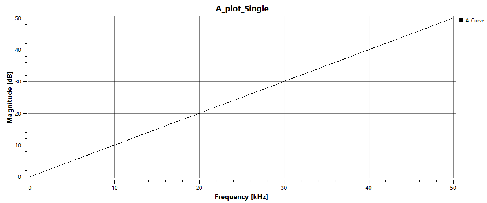
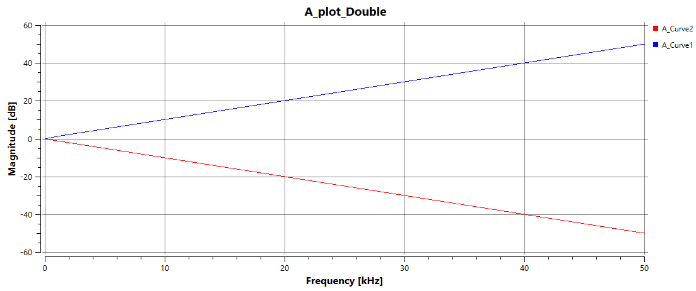
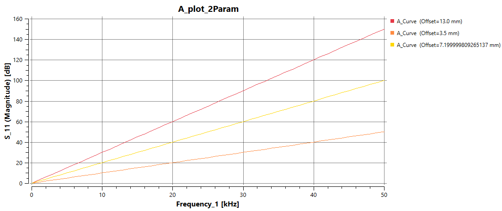
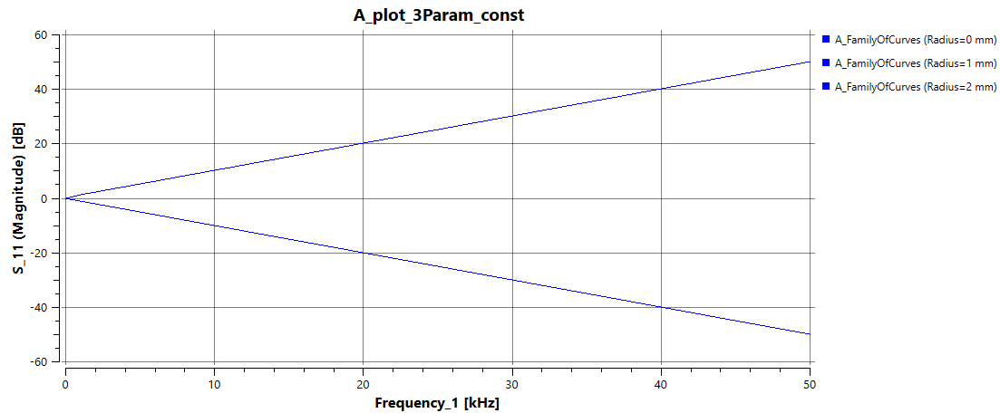
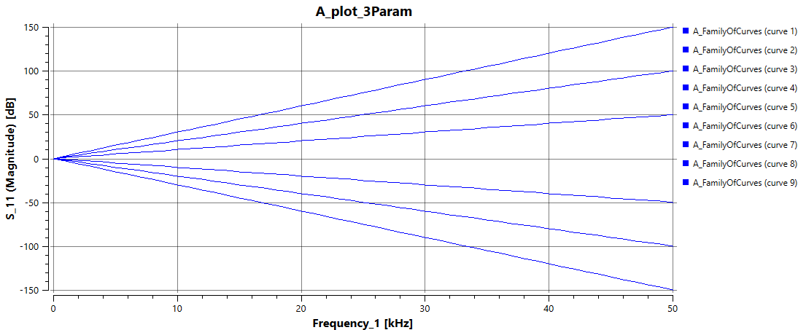
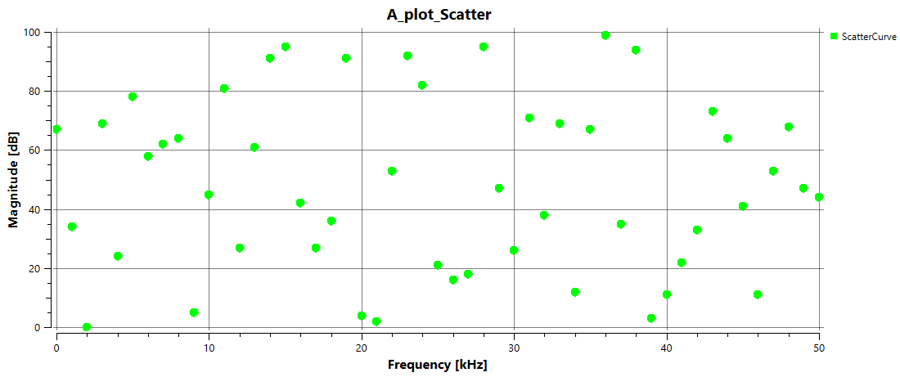
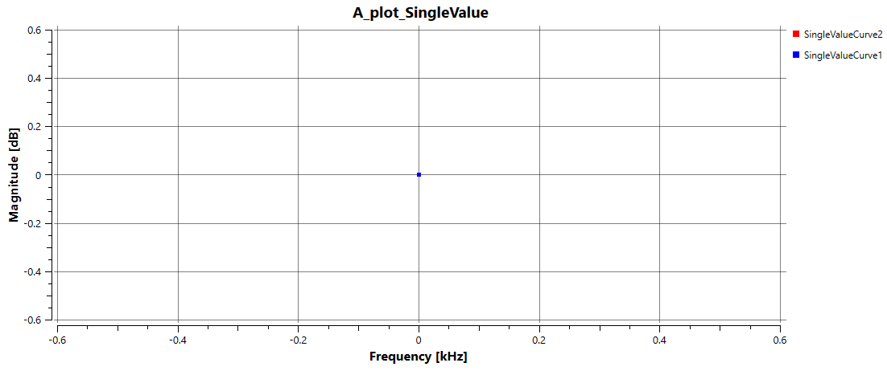
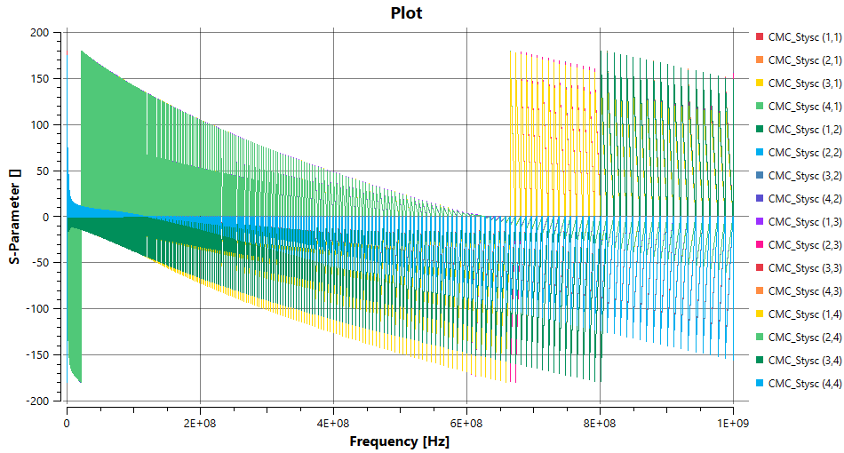

Plot Testing Specification
==========================

Single Curve
-------------

.. list-table::
   :header-rows: 1
   :widths: 5 25 25 30

   * - #
     - Setup
     - Execution
     - Expectation

   * - 1
     - Create a developer project.
     - Select the button **"Single Curve"** in the Debug Tab.
     - A plot is created in the Test folder. The plot looks like the reference image. Check especially:
        - Units are set
        - Plot name matches the entity name of the plot entity
        - Curve label matches the curve entity's name
       

   * - 1.1
     - 
     - Change curve properties (line style, thickness, colour).
     - Curve updates with new settings. Process should be quick (UI should not re-query data).

   * - 1.2
     - 
     - Close and reopen the plot view.
     - Updated curve properties persist.

   * - 1.3
     - 
     - Rename the curve entity.
     - Curve title updates to the new entity name.

   * - 1.4
     - 
     - Rename the plot entity.
     - Plot title updates to the new entity name.

   * - 1.5
     - 
     - In plot properties:
         - Set "Number of queries" to 1
         - Define query 1:
             - Name: `Magnitude`
             - Comparator: `<` 
             - Value: `30`
     - Curve is not plotted for values ≥ 30. Zooming out confirms data are truly filtered, not just zoomed.

   * - 1.6
     - 
     - In plot properties:
         - Set "Number of queries" to 2
         - Define query 2:
             - Name: `frequency`
             - Comparator: `Range`
             - Value: `[10, 20]`
     - Only frequencies from 10 to 20 are plotted.

   * - 1.7
     - 
     - Disable `Autoscale` in Y axis group. Set min = 10, max = 15.
     - Only the section of the curve from 10 to 15 is shown.

---

Two Curves
-----------

.. list-table::
   :header-rows: 1
   :widths: 5 25 25 30

   * - #
     - Setup
     - Execution
     - Expectation

   * - 2
     - 
     - Select the button **"Two Curves"** in the Debug Tab.
     - A plot is created in the Test folder. The plot looks like the image. Check:
         - Units are set
         - Plot name matches the plot entity name
         - Curve labels match curve entity names

   * - 2.1
     - 
     - Select the entity `A_Curve1`.  
     - `A_Curve1` is shown in its selected colour; `A_Curve2` is grayed out.

   * - 2.2
     - 
     - Select the entity `A_Curve2`.  
     - `A_Curve2` is shown in its selected colour; `A_Curve1` is grayed out.

   * - 2.3
     - 
     - Select the plot entity `A_plot_Double`.  
     - Both curves are shown in their selected colours.

Family of Curves
----------------

.. list-table::
   :header-rows: 1
   :widths: 5 25 25 30

   * - #
     - Setup
     - Execution
     - Expectation

   * - 3
     - 
     - Select the button **"Family of Curves"** in the Debug Tab.
     - A plot is created in the Test folder. The plot looks like the image. Check:
         - Units are set
         - Plot name matches the plot entity name
         - Curve labels match curve entity names

   * - 3.1
     - 
     - Change colour setting to `Fill` and choose a colour. 
     - All three curves appear in the chosen colour.

   * - 3.2
     - 
     - Close and reopen the plot view.
     - Curves retain the chosen colour.

   * - 3.3
     - 
     - Set colour setting to `Style Reference` and choose `Rainbow 0`.  
     - Each curve appears in a different colour.

---

Family of Curves with Third, Constant Parameter
-----------------------------------------------

.. list-table::
   :header-rows: 1
   :widths: 5 25 25 30

   * - #
     - Setup
     - Execution
     - Expectation

   * - 4
     - 
     - Select the button **"Family of Curves 3P const"**.
     - A plot is created. Check that:
         - Curve titles consist of the entity name and radius values in brackets
         - The output window states: "Offset = 3.5 mm"

   * - 4.1
     - 
     - Change the name of the curve entity.
     - In the curve titles, only the entity name changes, the brackets remain

---

Family of Curves with Third Parameter
-------------------------------------

.. list-table::
   :header-rows: 1
   :widths: 5 25 25 30

   * - #
     - Setup
     - Execution
     - Expectation

   * - 5
     - 
     - In the Debug Tab, select the button "Family of Curves 3P"
     - A plot is created in Test folder. Plot looks like image. Check especially if: The curve name consists of the entity name and (curve x). The ouput window shows: 
         - A_FamilyOfCurves (curve 1):
	         - Offset = 13.0 mm
	         - Radius = 0 mm
         - A_FamilyOfCurves (curve 2):
	         - Offset = 13.0 mm
	         - Radius = 1 mm
         - A_FamilyOfCurves (curve 3):
	         - Offset = 13.0 mm
	         - Radius = 2 mm
         - A_FamilyOfCurves (curve 4):
	         - Offset = 3.5 mm
	         - Radius = 0 mm
         - A_FamilyOfCurves (curve 5):
	         - Offset = 3.5 mm
	         - Radius = 1 mm
         - A_FamilyOfCurves (curve 6):
	         - Offset = 3.5 mm
	         - Radius = 2 mm
         - A_FamilyOfCurves (curve 7):
	         - Offset = 7.199999809265137 mm
	         - Radius = 0 mm
         - A_FamilyOfCurves (curve 8):
	         - Offset = 7.199999809265137 mm
	         - Radius = 1 mm
         - A_FamilyOfCurves (curve 9):
	         - Offset = 7.199999809265137 mm
	         - Radius = 2 mm 

   * - 5.1
     - 
     - Change the name of the curve entity.
     - In the curve titles, only the entity name changes, the brackets remain

---

Scatter
-------

.. list-table::
   :header-rows: 1
   :widths: 5 25 25 30

   * - #
     - Setup
     - Execution
     - Expectation

   * - 6
     - 
     - In the Debug Tab, select the button "Scatter Plot"
     - A plot is created in Test folder. Plot looks like image.

---

Single Dot
----------

.. list-table::
   :header-rows: 1
   :widths: 5 25 25 30

   * - #
     - Setup
     - Execution
     - Expectation

   * - 7
     - 
     - In the Debug Tab, select the button "Single value plot"
     - The plot should show only a single dot. Plot looks like image.

   * - 7.1
     - 
     - Select the SingleValueCurve2 entity
     - The red dot is now shown in the colour of the SingleValueCurve2 curve.

---

Matrix and Manual Plot Creation
-------------------------------

.. list-table::
   :header-rows: 1
   :widths: 5 25 25 30

   * - #
     - Setup
     - Execution
     - Expectation

   * - 8
     - Import the Touchstone file CMC_Stysc
     - In the Dataset folder, select the CMC_Stysc entity and execute the "Create Plot" button in the "Model" tab
     - In the folder Plots, a new plot appears, that looks like the image. The curve names consist of the entity name and have matrix indices in the chape of (x,y) behind
   
   * - 8.1
     - 
     - In the plot entity settings, deselect the property "show entire matrix"
     - Only one curve is now displayed

   * - 8.2
     - 
     - change the Show matrix column/row property values in the plot entity
     - Different curves are shown

   * - 8.3
     - 
     - Select the plot entity of Single Curve and the curve entity of the Scatter plot. Execute the button "Add curve to plot" in the model tab
     - Another curve entity is added below the plot entity of the Single Curve. Both curves are now displayed in the same view.

