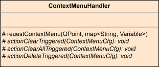

Context Menu Proposal
#####################

Where are context menus needed?
*******************************

The following lists show widgets that could have a context menu.  

Preferred widgets
=================

.. list-table::
   :header-rows: 1

   * - Name
     - Context
     - Options
   * - Output
     - 
     - - Select All
       - Clear
   * - Navigation Tree
     - Hovered item
     - - Delete
       - Clone **\***
       - Rename **\***
       - Visualize **\*\***
   * - 3D View
     - - Geometry
       - Face
       - Edge
     - - Delete
       - Hide
       - ...
   * - Graphics View
     - - Item
       - Connection
     - 

**\*** would be a good feature to add  

**\*\*** A new *Visualization Mode* flag (or similar) would allow disabling visualization
for calculation / data intensive requests on entity selection.

Unclear
=======

.. list-table::
   :header-rows: 1

   * - Name
     - Context
     - Options
   * - Property Grid?
     - - Property
     - 
   * - Tool Bar Buttons?
     - 
     - 
   * - Text Editor?
     - 
     - Example: |br|
       Python script: *Add breakpoint here*
   * - Table?
     - 
     - 
   * - Plot
     - 
     - Question: |br|
       Will the property grid and modal tool bar be enough?
   * - Version Graph
     - 
     - Examples: |br|
       - Rename version
       - Create branch

Note:

It might be a useful feature to explicitly create a new branch in order to avoid
misclicking in the *"delete all other data in branch irreversibly :D"* dialog.

Existing Context Menu Configuration
***********************************

.. image:: images/context_menu_gui_classdia.drawio.svg
   :alt: Context menu GUI class diagram

How do we set up the context menus?
***********************************

The context menu can either be **static** (fixed code on widget side) or **dynamic**.

- All the UI is dynamic, so keeping this approach would be consistent.

Advantages:

- Allows full customization of context menus
- Requires server-side context menu creation
- Synchronous request handling preferred

.. image:: images/context_menu_request_sequence.drawio.svg
   :alt: Context menu request sequence diagram

What are the context menus doing?
*********************************

Internal Handling
=================

Different possible actions:

- ``Clear``
- ``Delete``
- ``PressButton``
- ...

-> Widgets can bind default logic to these actions.

Examples:
---------

- Text editor: ``Clear``
- Graphics view: delete context handling via item delete request signal
- Trigger a tool button via its **button path**

External Handling
=================

- Trigger any action with context data

Base Class for Widgets
**********************

