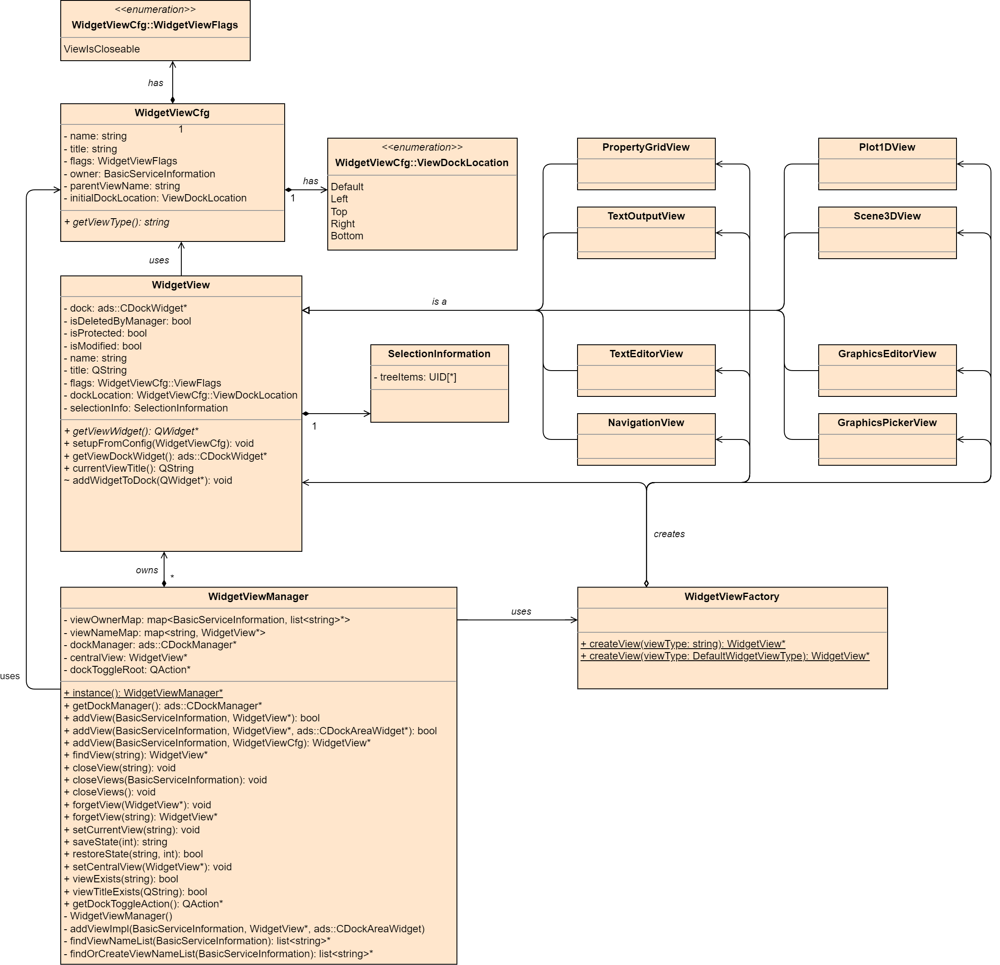
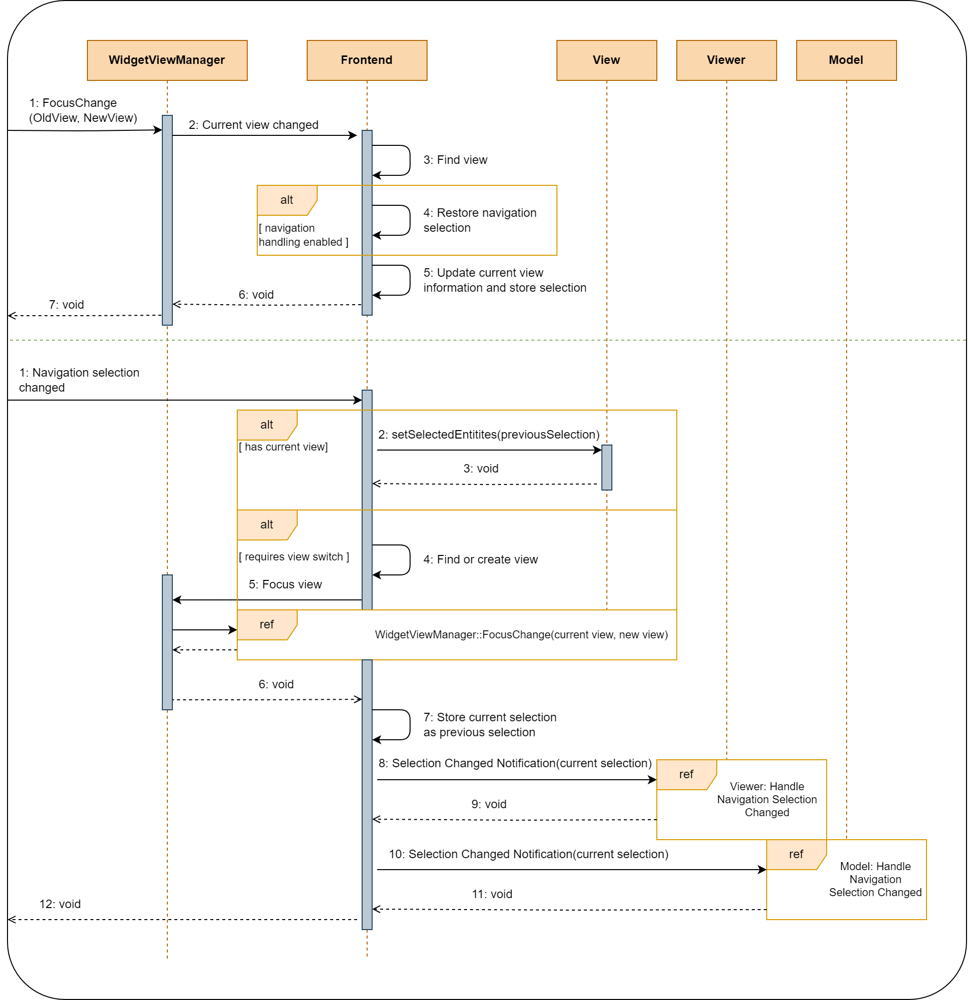

View Handling
=============

Proposal:

Class Diagram
*************

Sequence Diagram
****************

General View and Navigation Interaction
***************************************

The following table displays the expected results for a given frontend event.

.. list-table:: Expected Results for Frontend Events
   :header-rows: 1

   * - Event
     - Expected Result

   * - Navigation item selected by user.
     - #. If a current view exists the previous selection will be stored.
       #. The scene node gets updated.
       #. Scene node requests views if needed (views get input focus flag set to false).
       #. Model service gets notified about new current selection.
       #. Previous selection is set to the current selection.

   * - Navigation item selected from code.
     - #. If a current view exists the previous selection will be stored.
       #. The scene node gets updated.
       #. Model service gets notified about new current selection.
       #. Previous selection is set to the current selection.

   * - Central view focused by user.
     - #. Block navigation signals
       #. Restore selection according to views buffered selection.
       #. Unlock navigation signals and manually call selection changed slot.
       #. Update scene node information.
       #. Show corresponding modal menu tab.
       #. Notify model about selection change.

   * - Central view focused from code.
     - #. Update scene node information.
       #. Show corresponding modal menu tab.
       #. Notify model about selection change.

The add item action is sent whenever the user dropped a Graphics Item on the View.